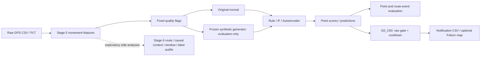
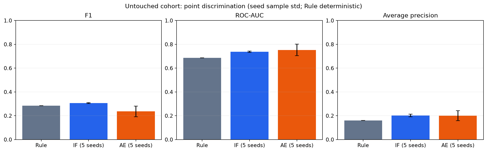

# PathGuard_Ai

GPS trajectory의 movement feature에서 비정상 이동 패턴을 탐지하고, 새로운 사용자에서 point·event·notification 결과가 얼마나 재현되는지 검증한 연구형 ML 프로젝트다. **Stage 1–7 구현과 최종 연구 평가를 완료했다.** Stage 7은 새 unseen-user cohort에 기존 모델과 정책을 한 번 적용한 confirmatory validation이며, 낮은 결과도 재튜닝 없이 보존했다.

## 문제 정의

학습한 사용자와 다른 사용자의 이동 다양성이 anomaly score, route event detection, false alerts에 미치는 영향을 다룬다. 이 프로젝트의 핵심은 baseline 비교, seed stability, 실패 원인 분석과 사전 동결 평가다. 실제 위험 행동을 판별하는 서비스로 검증한 결과는 아니다.

## Dataset

Microsoft [GeoLife 공식 user guide](https://www.microsoft.com/en-us/research/publication/geolife-gps-trajectory-dataset-user-guide/) 기반 GPS trajectory를 사용했다. Stage 5/6은 users **000–019**; Stage 7은 고정 후보 **020–039**를 각 사용자 filename 정렬 first5로 선택했다.

| Final cohort | Count |
| --- | --- |
| Requested / available / missing users | 20 / 20 / 0 |
| Input / eligible trajectories | 100 / 84 |
| Fixed quality exclusions / exact duplicate exclusions | 16 / 0 |
| Users with eligible trajectories | 19 |
| Original quality-valid normal rows | 223,289 |
| Synthetic samples / quality-valid anomaly rows | 336 / 9,263 |
| Route events | 84 |
| Prior-user overlap / lineage errors | 0 / 0 |

User **021**의 first5가 모두 기존 quality policy를 통과하지 못했다. 사용자를 교체하지 않고 manifest와 per-user 결과에 유지했으며, metric은 NA로 표시한다. User-macro의 유효 support는 **19/20**이다.

## Architecture



8 features: time_diff_sec, distance_m, speed_mps, acceleration_mps2, direction_change_deg, stop_duration_sec, bearing_sin, bearing_cos. 실제 사용 stack: Python, Pandas, NumPy, scikit-learn, PyTorch, Folium, Matplotlib, Numba.

## Stage overview

| Stage | 구현 및 연구 |
| --- | --- |
| 1 | GPS data loading / route visualization |
| 2 | Movement feature engineering |
| 3 | Data quality / synthetic anomalies |
| 4 | Train-only scaling / row Autoencoder |
| 5 | Multi-user split / dedup / unseen-user / seed / baseline comparison |
| 6 | Representation, spatial route, causal context, window similarity, label, event, alert audit |
| 7 | Protocol freeze / new-user final evaluation / figures / inference demo / portfolio |

## Key experiments

Stage 4에서 8→16→8→4 bottleneck Autoencoder를 구현했다. Stage 5에서는 user split과 5-seed 비교로 사용자 일반화와 변동성을 확인했고, Rule/IF baseline과 비교했다. Stage 6에서는 absolute route 정보가 없는 movement representation, spatial coverage 부족, causal context와 window similarity의 제한, label 경계 및 point/event 단위 차이를 조사했다. Validation에서 고정한 G0_C60 정책은 notification 수를 줄였지만 detection 손실을 동반했다. [연구 흐름](docs/final_research_summary.md)에 실패한 접근과 해석을 기록했다.

## Final results

IF/AE는 사전 고정된 5개 seed(7, 21, 42, 100, 2026)의 평균 ± 표본 표준편차(ddof=1)다. Rule은 결정론적 단일 결과이므로 seed 표준편차를 NA로 둔다. 단위가 표시되지 않은 비율은 0–1이다.

| Detector | F1 | Recall | FPR | ROC-AUC | AP |
| --- | --- | --- | --- | --- | --- |
| Rule | 0.2841 | 0.3870 | 0.0555 | 0.6857 | 0.1599 |
| Isolation Forest | 0.3067 ± 0.0032 | 0.4247 ± 0.0103 | 0.0558 ± 0.0019 | 0.7370 ± 0.0053 | 0.2021 ± 0.0113 |
| Autoencoder | 0.2364 ± 0.0453 | 0.3508 ± 0.1050 | 0.0652 ± 0.0104 | 0.7529 ± 0.0486 | 0.2007 ± 0.0416 |




다음 표는 **LOCKED notification** 평가다. Raw point event EDR과 단위가 다르다.

| Detector | Notification EDR | Early@25 | False notifications/1000 |
| --- | --- | --- | --- |
| Rule | 0.5833 | 0.3333 | 15.4777 |
| Isolation Forest | 0.5714 ± 0.0429 | 0.4071 ± 0.0296 | 15.4974 ± 0.3001 |
| Autoencoder | 0.6452 ± 0.0330 | 0.3690 ± 0.0304 | 16.7729 ± 1.2143 |


Raw point route EDR은 Rule 0.8095, IF 0.8357±0.0155, AE 0.9000±0.0707이다. 높은 event EDR에 비해 route point recall과 coverage는 낮다. G0_C60은 raw 대비 false notification 수를 약 49.64% / 42.71% / 58.26% 줄였지만, locked normal any-notification은 Rule/IF 100%, AE 99.76%다. 생산 환경에서 충분한 alert specificity를 확보했다는 결론을 내리지 않는다.

[최종 상세 보고서](docs/stage7_final_validation.md) · [동결된 공개 요약 CSV/manifest](docs/artifacts/stage7/) · [한국어 포트폴리오](docs/portfolio_summary_ko.md)

## Demo

Python 3.11.9와 [동결 환경](configs/stage7_environment.lock.txt)을 사용한다. **기존 모델·scaler·config·protocol receipt·alert lock을 별도로 확보해야 한다.** Git clone만으로 binary model이나 원본/가공 dataset이 내려오지는 않는다.

```powershell
.\.venv\Scripts\Activate.ps1
python -m src.run_pathguard_demo --input examples/demo_trajectory.csv --detector ae --seed 42 --output-dir outputs/demo/public_ae42 --map
python -m src.run_pathguard_demo --input examples/demo_trajectory.csv --detector if --seed 42 --output-dir outputs/demo/public_if42
python -m src.run_pathguard_demo --input examples/demo_trajectory.csv --detector rule --output-dir outputs/demo/public_rule
```

입력은 timestamp, latitude, longitude CSV이며 altitude/user_id/trajectory_id는 선택이다. 예제는 관측된 이동 기록을 포함하지 않는 200행 인공 원형 trajectory다. [예제 정의](examples/README.md)에 수식을 공개했으며 Final cohort와 기존 사용자 기록을 사용하지 않는다. 출력 demo_predictions.csv에는 anomaly_score, point_prediction, notification과 features가 들어간다. Quality-invalid 행은 unknown으로 보존하고 notification을 발생시키지 않는다. Seed42는 Stage4/5 canonical seed이며 Final best seed 선택이 아니다. 기존 output 경로 재사용은 거부된다.

## Reproducibility

[재현 안내](docs/reproducibility.md)에 환경, 데이터 구조, frozen artifact 경로, 최초 실행 순서, 이미 완료된 결과의 검증 방법을 구분했다.

```powershell
python -m src.stage7_protocol --phase verify
python -m src.evaluate_final_validation --verify-existing
python -m src.verify_final_validation
python -m unittest discover -s tests -v
```

최종 전체 **543 tests PASS**(Stage 7 신규85). Stage 1–6 보호파일 **578개 changed=0**. 독립 verifier는 저장된 예측과 scalar alert replay로 결과를 재계산하며 새 inference를 실행하지 않는다. 최초 실제 평가 후 metric-producing source/config는 변경하지 않았다.

## Limitations

Synthetic anomaly는 실제 범죄·실종·위험 행동 label이 아니다. 원본을 normal로 간주하는 실험 가정도 실제 정상성의 보증이 아니다. GeoLife의 시간적·지역적 범위, 사용자별 이동 다양성, 20명 후보 중 19명만 평가 가능한 작은 cohort, route context generalization 한계가 있다. 높은 event detection은 event precision이나 production precision을 의미하지 않는다. 정상 trajectory의 거의 전부에 notification이 발생해 false-alert burden이 크다. Alert policy는 Stage 6에서 설계·동결한 정책이며 실제 online deployment, 지연·메모리·센서 오류 대응은 검증하지 않았다.

## Future work

Sequence Autoencoder/temporal encoder, self-supervised trajectory embedding, per-user adaptation, map/road context, real anomaly labels, independent Validation을 통한 calibration과 alert suppression, 큰 외부 dataset 검증을 연구 후보로 남긴다. 이번 프로젝트에 추가 실험을 구현하지 않았다.
