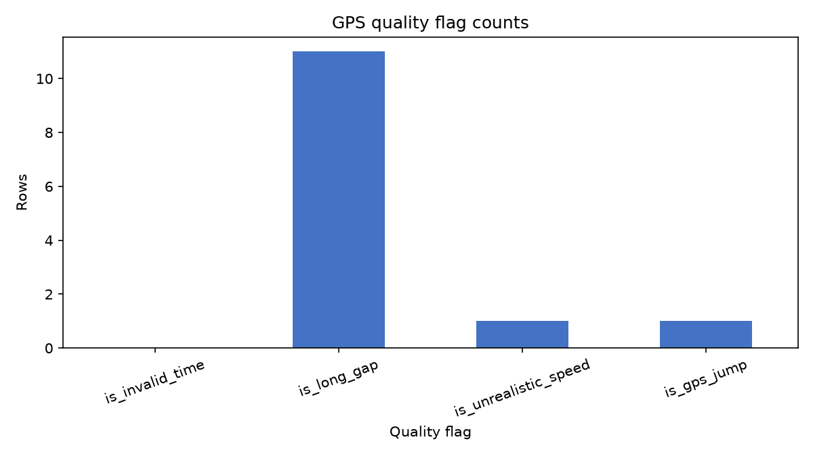
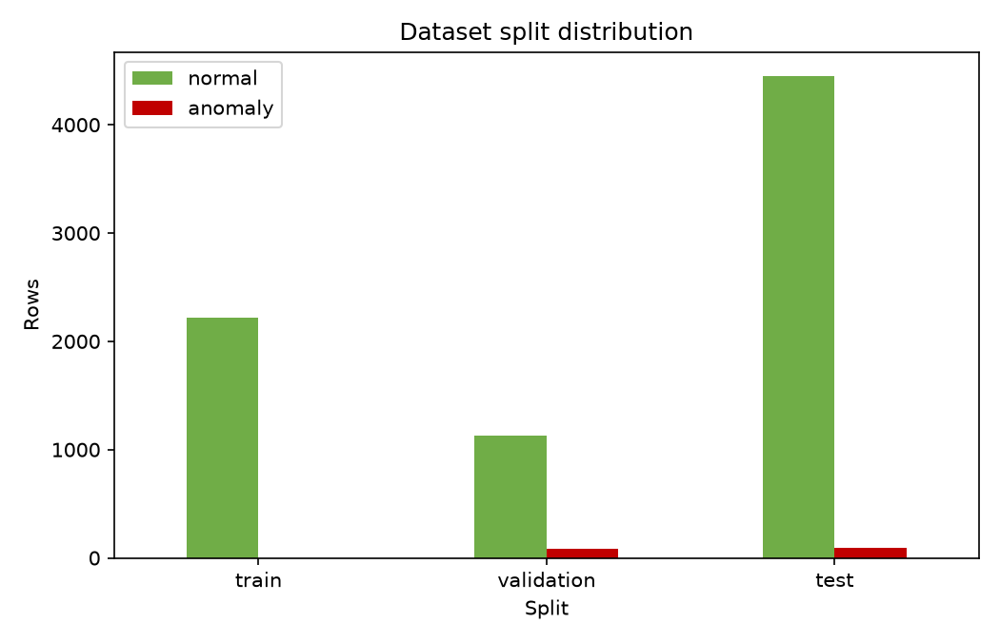
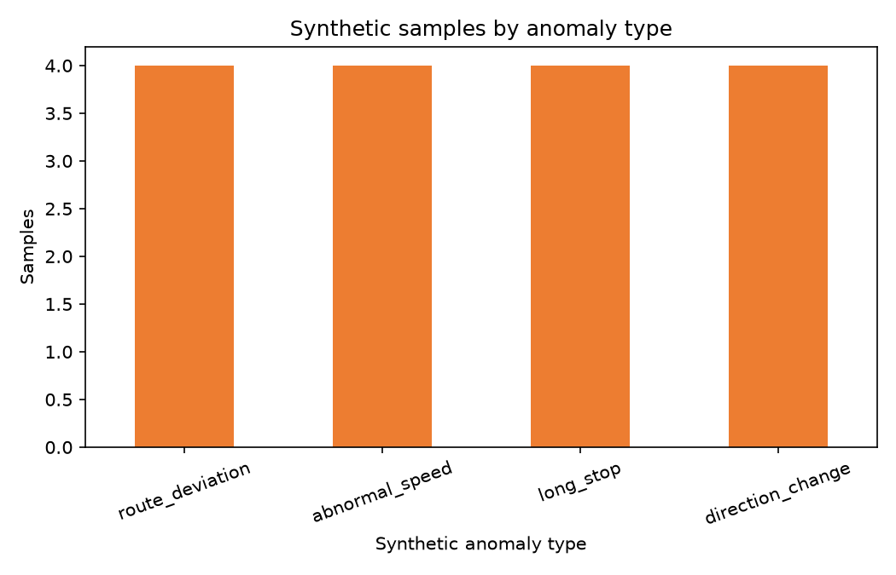
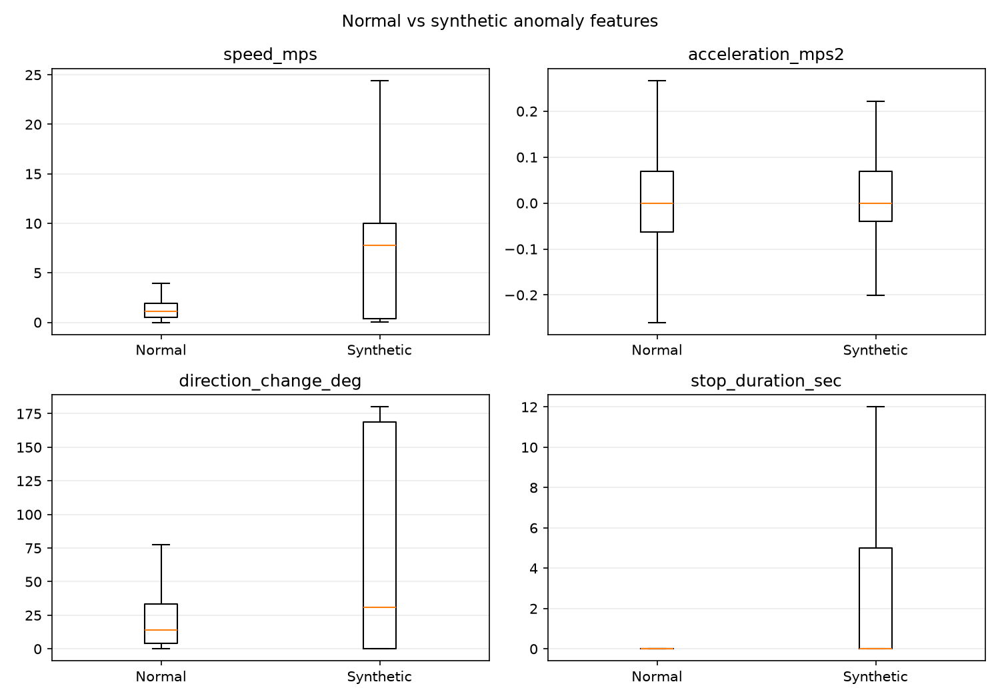
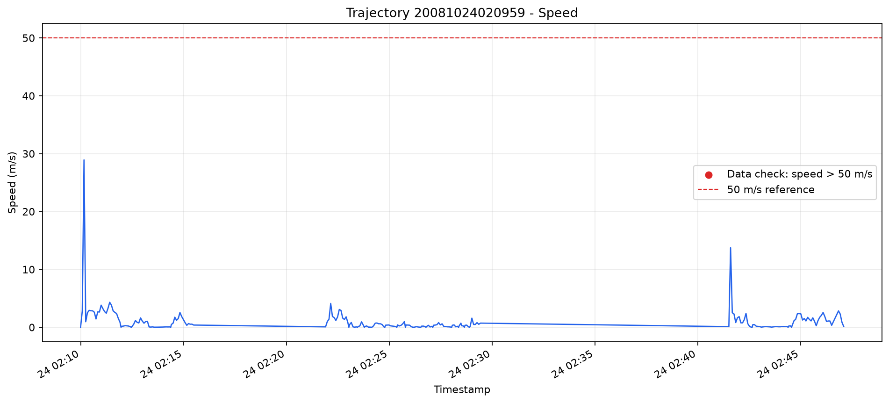
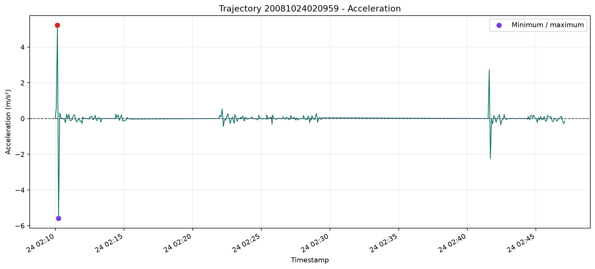
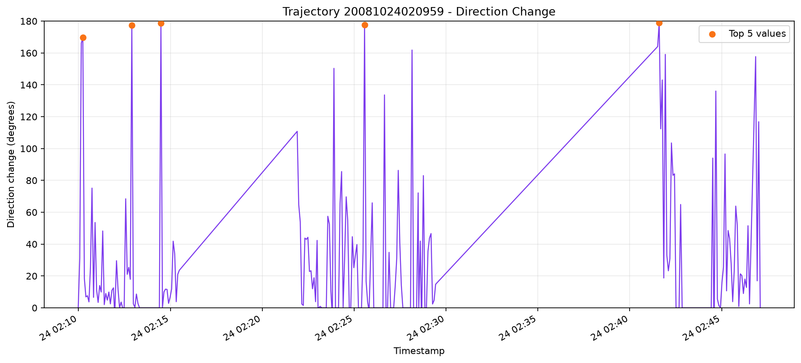
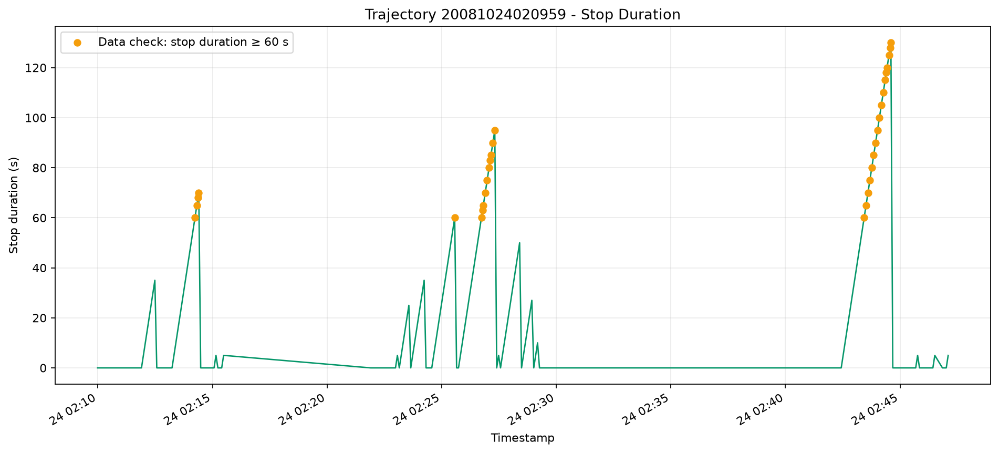
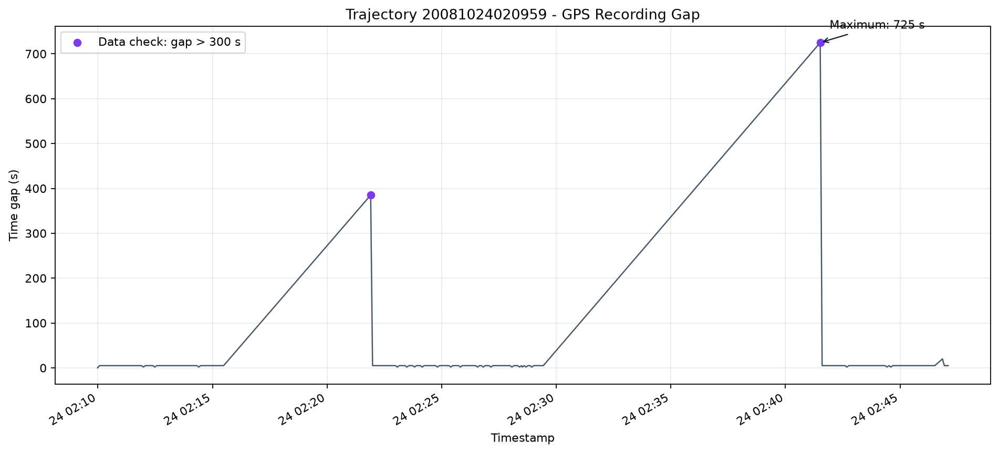

# PathGuard_Ai

# Stage 5: Multi-user Generalization

- Stage 5.1: Multi-user Dataset Preparation
- Stage 5.2: Single-seed Unseen-user Evaluation
- Stage 5.3: Multi-seed Stability
- Stage 5.4: Baseline Comparison

Stage 5 전체는 [PR #4](https://github.com/YYMini/PathGuard_Ai/pull/4)로 main에 squash merge했습니다.
최종 commit은 `f2e7eeed3f9cb4ffef9b635ca4205dda6954fab0`입니다.
Stage 6 작업은 최신 main 기반 `feature/stage-6-route-context`에서 분리해 진행합니다.

# Stage 6.4. Causal Trajectory / Window Similarity Identifiability Audit

W=10/25/50, gap=0/10/25/50, prior/prefix/combined의 36개 사전 정의 조합에서
정상 46,299 / route deviation 378 endpoint를 모두 분석했습니다.
겹치지 않는 과거 window의 absolute-space discrete Frechet distance를 비교하며
reference stride=10의 제한된 grid 내 최소값은 정확하게 계산합니다.
W10/gap0 combined ROC-AUC/AP는 **0.686174/0.012270**, hard subset AUC는 **0.683646**입니다.
Train-median 이하 step-distance subset에서는 제한된 추가 신호가 있지만,
전체 route 분리력 개선과 장기 route memory의 성공은 입증하지 못했습니다.

전체 **307개 테스트 PASS**(신규 35), 실제 audit **349.04초**, 보호 파일 **370개 변경 0**,
causality/overlap 위반 **0**입니다. [38개 항목의 상세 보고서](docs/stage6_window_similarity_audit.md)에
전체 config·상관·hard/low-distance·사용자·boundary·다음 후보를 기록했습니다.
Stage 6.4는 미커밋/미푸시이며 Stage 6.5/7과 새 모델은 구현하지 않았습니다.

```powershell
python -m src.audit_trajectory_window_similarity
```

# Stage 6.3. Inference-observable Context Reference & Abstention Audit

같은 사용자의 prior trajectories와 현재 관측 prefix를 timestamp<현재 시각 조건으로 replay했습니다.
Label/onset/source 원본은 reference나 support에 사용하지 않았고, 관측된 synthetic prefix도 그대로 memory에 포함했습니다.
Combined normal coverage@50m는 **99.90%**, ROC-AUC/AP는 **0.76878/0.07744**입니다.
다만 정상 prefix distance의 **87.11%**가 기존 step-distance와 같아 habitual route 식별을 증명하지 않습니다.
사용자별 combined ROC-AUC는 **0.578~0.854**이며, progression late score 감소는 확인되지 않았습니다.

```powershell
python -m src.audit_context_reference
```

전체 **272개 테스트 PASS**(신규 32), audit **45.23초**, 보호 파일 **273개 checksum 유지**,
causality 위반 **0**입니다. 기존 출력은 덮어쓰지 않습니다.
[Stage 6.3 보고서](docs/stage6_context_reference_audit.md)에 정보 조건·availability·support·boundary·7개 그래프를 기록했습니다.
Stage 6.3은 `8a7172b`로 게시했으며 로컬/원격 HEAD가 일치합니다.

# Stage 6.2. Train-only Route Reference Coverage & Abstention Audit

Train 정상 86,067 point만으로 BallTree spatial reference를 구성했습니다.
Test 정상 coverage@100m는 **36.53%**, 사용자별로 **26.11~76.68%**입니다.
전체 거리 score ROC-AUC/AP는 **0.39995/0.00612**, source-matched delta median은 **+39.20m**입니다.
판정은 **B + D**이며, 원본 source가 covered라는 조건의 분리 신호는 audit용 oracle 결과입니다.
Global 거리 feature를 모델에 바로 추가하지 않고, 실제 관측 가능한 context·coverage gate의 검증을 제안합니다.

```powershell
python -m src.audit_route_reference_coverage
```

전체 **240개 테스트 PASS**(신규 32), audit **10.49초**, Stage 5·6.1 보호 파일 **253개 checksum 유지**,
leakage **0**입니다. 기존 출력이 있으면 덮어쓰기를 거부합니다.
[Stage 6.2 보고서](docs/stage6_route_reference_coverage.md)에 coverage·paired delta·boundary·6개 그래프·한계를 기록했습니다.
Stage 6.2는 `e657c8c`로 checkpoint 게시했고 local/remote HEAD가 일치합니다. 모델·feature·threshold는 변경하지 않았습니다.

# Stage 6.1. Route Representation & Synthetic Label Audit

고정 데이터와 기존 점수만 감사했으며 모델 학습·추론·threshold/scaler 재계산은 하지 않았습니다.
Test route 378개 중 **307개(81.2169%)**가 8 feature의 Train marginal p01~p99 안에 있습니다.
변위 median은 **118.010872m**, 원본과 8 feature가 동일한 labelled point는 **19개**입니다.
Train trajectory의 200m longitude 회전 반례에서 8 feature가 동일하게 유지돼 절대 위치 정보의 한계를 확인했습니다.
실제 주입은 acceleration/bearing도 바꾸므로 모든 route가 feature에서 동일하다고 해석하지 않습니다.
판정은 **D(복수 문제 관찰)**이며 원인별 기여율은 검증되지 않았습니다.
Stage 6.2는 Train-only route reference의 coverage/abstention 검증을 제안하며 아직 구현하지 않았습니다.

```powershell
python -m src.audit_route_representation
```

기존 출력이 있으면 덮어쓰기를 거부합니다. 전체 **208개 테스트 PASS**(신규 20개), audit **16.93초**,
보호 파일 **235개 checksum 유지**, cross-split leakage **0**입니다.
[Stage 6.1 보고서](docs/stage6_route_representation_audit.md)에 규칙·통계·사용자 결과·6개 그래프·누수 조건을 기록했습니다.
Stage 6.1은 `feature/stage-6-route-context`에서 검증 후 checkpoint로 게시합니다. Stage 6 PR/main merge 및 Stage 6.2 구현은 진행하지 않습니다.

# Stage 5.4. Baseline Comparison

동일 frozen dataset과 8 feature, Train 정상 fit, Validation 정상 p95 threshold에서
Statistical Rule·Isolation Forest·기존 Stage 5.3 Autoencoder 5 seeds를 비교했습니다.
Rule은 Train median/IQR 기반 최대 절대 편차를 쓰는 deterministic 단일 실행이며,
IF는 200 trees와 고정 5 seeds를 사용합니다. AE 학습·추론·threshold 재계산은 수행하지 않았습니다.

```powershell
python -m src.compare_stage5_baselines
```

Test F1: Rule **0.2569**, IF **0.2660 ± 0.0054**, AE **0.2291 ± 0.0474**.
IF/AE ROC-AUC는 **0.7467 / 0.7476**, AP는 **0.2106 / 0.1568**입니다.
AE는 abnormal_speed Recall, IF는 long_stop/direction_change Recall에서 상대적 강점을 보였고,
route_deviation은 세 방식 모두 낮았습니다. 모델 우승이나 architecture의 인과적 한계로 결론내리지 않습니다.
전체 **188개 테스트 통과**, 실험 **33.03초**, 데이터와 기존 AE 산출물 checksum을 보존했습니다.
[Stage 5.4 보고서](docs/stage5_baseline_comparison.md)에 사전 점수 정의·공정성·전체/사용자/유형 지표와
6개 그래프·후속 문제 후보를 기록했습니다. Stage 5.3은 `ff5ca3e`로 게시했고 Stage 5.4는 `19c603a`로 게시했으며 local/remote SHA가 일치합니다.

# Stage 5.3. Multi-seed Stability

동일 dataset·split·synthetic data·모델·학습 설정으로 model seed **7, 21, 42, 100, 2026**을 비교했습니다.
기존 seed 42는 config/checksum 및 복원 예측 검증 후 재사용하고, 나머지 4개 seed를 새로 학습했습니다.

```powershell
python -m src.evaluate_multi_seed_stability
```

Test F1은 **0.2291 ± 0.0474**, ROC-AUC는 **0.7476 ± 0.0341**,
Average Precision은 **0.1568 ± 0.0290**입니다(5 seeds, sample std ddof=1).
전체·사용자 macro·사용자별·이상 유형별 mean/std/min/max와 6개 집계 그래프를 저장했습니다.
전체 **164개 테스트가 통과**했으며 dataset과 기존 seed 42 산출물을 보존했습니다.
자세한 결과·seed 42 위치·해석은 [Stage 5.3 보고서](docs/stage5_multi_seed_stability.md)를 확인하세요.
Stage 5.3은 검증 후 단계별 커밋으로 게시하며 PR과 main merge는 Stage 5 완료 후 결정합니다.

# Stage 5.2. Single-seed Unseen-user Evaluation

Stage 4와 동일한 8 feature·Autoencoder·학습 설정으로 처음 보는 사용자를 평가했습니다.
Stage 5.1의 dedup dataset과 사용자 split을 그대로 사용하고, seed 42 한 번만 실행했습니다.

```powershell
python -m src.train_multiuser_autoencoder
```

Train 86,067행에만 scaler를 fit했습니다. Validation 정상 19,448행만으로
checkpoint와 threshold를 결정한 뒤 Test 48,411행을 평가했습니다.
Best epoch는 98, Validation normal loss는 0.0447033457,
95th percentile threshold는 0.1442467570입니다. CPU 실행 시간은 146.78초입니다.

Test 결과는 Precision 0.1682, Recall 0.2789, F1 0.2098, ROC-AUC 0.7225,
Average Precision(AP) 0.1631, FPR 0.0629입니다. 사용자 macro F1은 0.2319입니다.
Stage 4와 평가 사용자·규모·이상 비율이 다르므로 변화량을 모델 우열로 해석하지 않습니다.

사용자별·이상 유형별 지표, Stage 4 비교, 명시적 lineage prediction CSV 및 9개 그래프를
`models/stage5/`, `outputs/metrics/stage5/`, `outputs/figures/stage5/`의 dataset/seed 경로에 저장했습니다.
기존 120개에 신규 25개를 추가해 전체 **145개 테스트가 통과**했습니다.
입력 dataset과 Stage 4 산출물은 실행 전후 checksum이 동일합니다.
자세한 설정·결과·해석은 [Stage 5.2 보고서](docs/stage5_autoencoder_generalization.md)를 확인하세요.

# Stage 5.1. Multi-user Dataset Preparation

GeoLife 사용자 `000~019`의 파일명순 첫 5개 경로를 처리하고 사용자 단위로
Train/Validation/Test를 분리합니다. 기존 특징·품질·합성 로직을 재사용하며
이 단계에서는 모델 학습을 실행하지 않습니다.

```powershell
python -m src.prepare_multiuser_dataset
python -m src.prepare_multiuser_dataset --validate-existing data/processed/stage5/geolife_u000_019_first5_seed42_dedup
```

실제 재생성 결과: 입력 100개 경로 중 모델용 82개 적격, 정제 후 155,743행,
유효 정상 151,814행입니다. Train은 51개 경로·86,067행이며, 평가용 Validation은
12개 경로·정상 19,448 + 합성 이상 1,113행, Test는 19개 경로·정상 46,299 + 합성 이상 2,112행입니다.
기존 사용자 split과 Validation/Test 결과를 유지했고, CSV round-trip과 원본 행 lineage를 검증했습니다.

동일 split의 exact duplicate는 원본 파일명·trajectory ID 순 첫 번째만 모델용으로 유지합니다.
Train 사용자 `014`의 중복 1개를 제외했으며, 정제 2,491행 중 모델용 정상 행 감소분은 2,482행입니다.
원본과 제외 사유는 입력/경로 manifest 및 summary·leakage·duplicate report에 보존합니다.
이 정책은 합성 생성 전에 모든 split에 적용하며, split 간 동일 fingerprint는 leakage error로 실패합니다.

감사용 split CSV와 합성 정상 복사 구간을 제외한 평가용 CSV를 별도로 저장합니다.
데이터는 `data/processed/stage5/<dataset_id>/` 아래에 생성하며 Git에서 제외합니다.
기존 테스트를 유지하고 중복 정책 테스트 13개를 추가해 전체 **120개 테스트가 통과**했습니다.
자세한 스키마·중복 정책·실제 결과는
[Stage 5.1 문서](docs/stage5_dataset_preparation.md)를 확인하세요.

# Stage 4. PyTorch Autoencoder 학습

Stage 4에서는 Stage 3에서 만든 Train / Validation / Test 분할 데이터를 사용해
정상 이동 패턴을 학습하는 가벼운 row-level PyTorch Autoencoder를 학습합니다.
학습에는 `data/processed/train.csv`의 원본 정상 데이터 중 학습 가능하고
품질이 낮지 않은 행만 사용합니다. 합성 데이터와 `anomaly_label=1` 행은
Train 데이터에서 제외합니다.

모델 입력은 다음 8개 feature입니다.

* `time_diff_sec`
* `distance_m`
* `speed_mps`
* `acceleration_mps2`
* `direction_change_deg`
* `stop_duration_sec`
* `bearing_sin`
* `bearing_cos`

`bearing_deg`는 원형 각도 값이 끊기지 않도록 scaling 전에 `bearing_sin`과
`bearing_cos`로 변환합니다. `latitude`, `longitude`, timestamp, ID, label,
품질 플래그, split 관련 metadata는 모델 입력으로 사용하지 않습니다.

전처리에는 `StandardScaler`를 사용하며, scaler는 필터링된 Train 행에만
fit합니다. Validation과 Test 행에는 Train 데이터로 fit된 scaler의 transform만
적용합니다. Validation / Test 평가 데이터에는 품질이 정상인 원본 정상 행
(`is_synthetic == False`, `anomaly_label == 0`, `is_low_quality == False`,
`is_training_eligible == True`)과 합성 이상 구간 행
(`is_synthetic == True`, `anomaly_label == 1`)만 포함합니다. 합성 이상 구간도
저품질 원본 GPS 행에서 파생된 경우에는 행동 이상 평가에서 제외합니다. 합성
trajectory에 복사되어 남아 있는 정상 구간(`is_synthetic == True`,
`anomaly_label == 0`)도 평가에서 제외합니다.

threshold는 Test 데이터를 사용하지 않고 Validation 정상 행의
reconstruction error만으로 결정합니다. 기본값은 Validation 정상
reconstruction error의 95번째 백분위수입니다. Validation의 합성 이상 데이터는
threshold가 정해진 뒤 평가에만 사용하며, threshold 최적화에는 사용하지 않습니다.
Test 데이터는 threshold 결정 이후 최종 평가에만 사용합니다.

실행 명령:

```powershell
python -m src.train_autoencoder
python -m src.train_autoencoder `
  --epochs 100 `
  --batch-size 64 `
  --learning-rate 0.001 `
  --patience 15 `
  --threshold-percentile 95 `
  --seed 42
```

Stage 4는 다음 파일을 생성합니다.

```text
models/stage4/pathguard_autoencoder.pt
models/stage4/scaler.joblib
models/stage4/training_config.json
models/stage4/feature_columns.json
outputs/metrics/stage4_validation_metrics.json
outputs/metrics/stage4_test_metrics.json
outputs/metrics/stage4_training_history.csv
outputs/metrics/stage4_validation_predictions.csv
outputs/metrics/stage4_test_predictions.csv
outputs/metrics/stage4_summary.csv
outputs/figures/stage4/
docs/images/stage4/
```

Validation / Test prediction CSV에는 식별 컬럼, label, `reconstruction_error`,
`predicted_anomaly`와 함께 `is_low_quality`, `quality_reason`,
`is_training_eligible`, `source_quality_valid` 및 주요 입력 feature 값을 함께
저장합니다.

실행 결과 요약:

| 항목 | 값 |
| --- | ---: |
| Device | CPU |
| Train rows | 2,217 |
| Validation rows | 328 |
| Test rows | 987 |
| Validation 정상 | 241 |
| Validation 이상 | 87 |
| Test 정상 | 900 |
| Test 이상 | 87 |
| Validation 저품질 정상 제외 | 3 |
| Validation 저품질 기반 합성 이상 제외 | 1 |
| Test 저품질 정상 제외 | 8 |
| Test 저품질 기반 합성 이상 제외 | 2 |
| Best epoch | 91 |
| Threshold | 0.5423517227 |
| Validation F1 | 0.6622 |
| Test accuracy | 0.9189 |
| Test precision | 0.5310 |
| Test recall | 0.6897 |
| Test F1 | 0.6000 |
| Test ROC-AUC | 0.8183 |
| Test PR-AUC | 0.5148 |

이 결과는 user `000` 기반 데이터로 Stage 4 학습 및 평가 파이프라인이 정상적으로
동작하는지 확인한 1차 검증입니다. 최종 일반화 성능을 의미하지는 않습니다. 향후에는
GeoLife 다중 사용자 데이터로 확장하고, row-level scoring에서 Window 또는
trajectory 단위 시계열 모델로 확장할 예정입니다.

# Stage 3. 학습 데이터 구성

Stage 3는 `gps_features.csv`를 품질 검사하고, 정상 trajectory에서 합성 이상행동을 만든 뒤
trajectory 단위로 train/validation/test 데이터셋을 구성합니다. 이 단계에서는 PyTorch,
Autoencoder, 모델 학습 및 이상 점수 계산을 구현하지 않습니다.

## 품질 검사와 정상 trajectory

측정 품질 플래그는 `time_diff_sec <= 0`(trajectory 첫 행 제외), 300초 초과 기록 공백,
50m/s 초과 속도, 그리고 60초 이내 1,000m 초과 GPS 점프입니다. 플래그가 하나라도 있는
행은 낮은 품질로 기록하지만 자동 삭제하지 않습니다. 첫 행은 초기 특징값이므로 학습에서는
제외합니다. 이 품질 플래그는 GPS 측정 신뢰도 표시이며 행동 이상 라벨이 아닙니다.

합성 데이터 후보는 100개 이상의 포인트, 낮은 품질 비율 5% 이하, 정상 timestamp 순서,
필수 특징의 NaN·무한대 없음 조건을 모두 만족해야 합니다. 현재 데이터에서는 5개 중 4개가
적격이며 `20081027115449`는 50개 포인트뿐이어서 제외되었습니다.

## 합성 이상행동과 특징 재계산

합성 실험 라벨은 실제 위험 정답이 아닙니다. 정상 경로 복사본의 일부 연속 구간에 다음 네
종류를 생성합니다.

* `route_deviation`: 부드럽게 증가·감소하는 100~300m 측면 이탈
* `abnormal_speed`: 10~45m/s 범위의 빠른 이동
* `long_stop`: 위치를 3m 이내로 고정한 장시간 정지
* `direction_change`: 좌우 15~40m 지그재그 이동

GPS 점프는 측정 품질 문제이므로 행동 이상으로 만들지 않습니다. 변형 뒤 Stage 2 로직으로
거리·속도·가속도·방위각·방향 변화·정지 시간을 다시 계산하여 좌표와 시간에 일관된 특징을
보장합니다.

## 분할과 누수 검사

동일 원본에서 나온 정상·합성 데이터가 서로 다른 split에 섞이지 않도록
`source_trajectory_id` 단위로 분할합니다. train에는 학습 가능한 정상 원본만 들어가며,
validation과 test에는 각 경로의 정상 및 합성 이상 데이터가 함께 들어갑니다. 실행 전에
source/sample 중복, train 합성·이상 라벨, validation/test 구성, NaN·무한대 및 CSV 재읽기를
검사합니다.

```powershell
python -m src.prepare_dataset
python -m src.prepare_dataset --input data/processed/gps_features.csv --output-dir data/processed --samples-per-type 1 --seed 42
python -m src.visualize_dataset --export-portfolio
```

생성 데이터는 `quality_checked.csv`, `trajectory_quality_summary.csv`,
`synthetic_anomalies.csv`, `synthetic_anomaly_manifest.csv`, `train.csv`, `validation.csv`,
`test.csv`, `split_manifest.csv`이며 모두 `data/processed/` 아래에 저장됩니다. 그래프는
`outputs/figures/stage3/`, 비교 지도는 `outputs/maps/stage3_synthetic_examples.html`에
생성됩니다. Git에서 추적할 포트폴리오 결과는 `docs/images/stage3/`에 있습니다.









PathGuard_Ai는 GPS 이동 데이터를 기반으로 이동 패턴과 이상행동 탐지를 연구하는 포트폴리오용 Python 프로젝트입니다.

1단계에서는 Microsoft GeoLife GPS Trajectories의 `.plt` 파일을 정제된 CSV로 변환하고, 이동 경로를 OpenStreetMap 지도에 시각화했습니다.

2단계에서는 trajectory별 GPS 이동 특징을 생성하고, 계산 결과와 데이터 품질을 시계열 그래프 및 Folium 지도에 시각화했습니다.

## 프로젝트 구조

```text
PathGuard_Ai/
├─ data/
│  ├─ raw/
│  │  └─ geolife/
│  │     └─ Data/
│  └─ processed/
├─ docs/
│  └─ images/
│     └─ stage2/
│        └─ 20081024020959/
├─ outputs/
│  ├─ figures/
│  └─ maps/
├─ src/
│  ├─ __init__.py
│  ├─ feature_engineering.py
│  ├─ load_geolife.py
│  ├─ visualize_features.py
│  └─ visualize_route.py
├─ tests/
│  ├─ test_feature_engineering.py
│  └─ test_visualize_features.py
├─ requirements.txt
├─ .gitignore
└─ README.md
```

## 설치 방법

Windows PowerShell에서 프로젝트 루트 `PathGuard_Ai`로 이동한 뒤 아래 명령을 실행합니다.

```powershell
python -m venv .venv
.\.venv\Scripts\Activate.ps1
python -m pip install --upgrade pip
python -m pip install -r requirements.txt
```

PowerShell 실행 정책으로 가상환경 활성화가 차단되면 현재 세션에 한해 다음 명령을 먼저 실행합니다.

```powershell
Set-ExecutionPolicy -Scope Process -ExecutionPolicy Bypass
```

## GeoLife 데이터 배치

GeoLife GPS Trajectories 데이터를 내려받아 압축을 푼 뒤, `Data` 폴더가 다음 위치에 오도록 배치합니다.

```text
data/raw/geolife/Data/
└─ 000/
   └─ Trajectory/
      ├─ 20081023025304.plt
      ├─ 20081024020959.plt
      └─ ...
```

GeoLife 원본 데이터는 용량과 라이선스 관리를 위해 Git 추적 대상에서 제외됩니다.

---

# Stage 1. GeoLife 데이터 로딩 및 경로 시각화

## GPS 데이터 변환

사용자 `000`의 파일명 기준 첫 5개 `.plt` 파일을 읽고 검증한 뒤 하나의 CSV로 저장합니다.

```powershell
python -m src.load_geolife
```

생성 파일:

```text
data/processed/gps_raw.csv
```

다음 항목을 검증합니다.

* 위도·경도 범위
* timestamp 변환 여부
* 중복된 trajectory와 timestamp 조합
* trajectory별 GPS 포인트 수
* 경로별 시작 및 종료 시간

## GPS 이동 경로 시각화

CSV의 첫 번째 trajectory를 지도에 표시합니다.

```powershell
python -m src.visualize_route
```

특정 `trajectory_id`를 선택할 수도 있습니다.

```powershell
python -m src.visualize_route --trajectory-id 20081026134407
```

생성 파일:

```text
outputs/maps/route_<trajectory_id>.html
```

예를 들어 위 명령은 다음 파일을 생성합니다.

```text
outputs/maps/route_20081026134407.html
```

존재하지 않는 ID를 입력하면 사용할 수 있는 trajectory ID 목록이 출력됩니다.

생성된 HTML 파일에서는 다음 내용을 확인할 수 있습니다.

* OpenStreetMap 배경 지도
* 전체 GPS 이동 경로
* 출발 지점
* 도착 지점
* 경로 전체 범위 자동 조정

지도 타일을 불러오려면 인터넷 연결이 필요합니다.

---

# Stage 2. GPS 이동 특징 전처리 및 시각화

## GPS 이동 특징 생성

`data/processed/gps_raw.csv`를 읽어 각 `trajectory_id` 안에서만 이동 특징을 계산합니다.

| 특징                     | 설명                       | 단위   |
| ---------------------- | ------------------------ | ---- |
| `time_diff_sec`        | 이전 GPS 포인트와의 시간 차이       | 초    |
| `distance_m`           | Haversine 공식으로 계산한 이동 거리 | m    |
| `speed_mps`            | 이동 거리 ÷ 시간 차이            | m/s  |
| `acceleration_mps2`    | 속도 변화 ÷ 시간 차이            | m/s² |
| `bearing_deg`          | 북쪽을 0°로 한 초기 방위각         | °    |
| `direction_change_deg` | 이전 방위각과의 최소 각도 차이        | °    |
| `stop_duration_sec`    | 연속 정지 구간의 누적 시간          | 초    |

모든 계산은 trajectory별로 독립적으로 수행합니다. 한 경로의 마지막 GPS 포인트와 다른 경로의 첫 번째 포인트가 연결되지 않도록 처리했습니다.

각 trajectory의 첫 번째 포인트는 이전 위치가 없으므로 계산된 특징값을 0으로 초기화합니다.

## 전처리 기준

이동 거리가 1m 미만이면 GPS 오차로 인한 방위각 흔들림을 줄이기 위해 직전 유효 방위각을 유지합니다.

다음 조건을 모두 만족하면 해당 구간을 정지 상태로 처리합니다.

```text
이동 거리 ≤ 3m
이동 속도 ≤ 0.5m/s
```

정지 조건이 연속되면 `time_diff_sec`를 누적하고, 다시 이동하면 `stop_duration_sec`를 0으로 초기화합니다.

## 전처리 실행

기본 입출력 경로로 실행합니다.

```powershell
python -m src.feature_engineering
```

입력과 출력 경로를 직접 지정할 수도 있습니다.

```powershell
python -m src.feature_engineering `
  --input data/processed/gps_raw.csv `
  --output data/processed/gps_features.csv
```

생성 파일:

```text
data/processed/gps_features.csv
```

## 전처리 검증 결과

GeoLife 사용자 `000`의 trajectory 5개를 대상으로 실행한 결과입니다.

| 항목            |     결과 |
| ------------- | -----: |
| 입력 행 수        |  3,424 |
| 출력 행 수        |  3,424 |
| Trajectory 수  |      5 |
| 유효하지 않은 시간 간격 |      0 |
| NaN 및 무한대     |      0 |
| 전체 단위 테스트     | 188개 통과 |

전체 데이터에서는 다음과 같은 극단값을 확인했습니다.

* `speed_mps` 50m/s 초과: 1개
* 최대 GPS 기록 간격: 18,453초
* 전체 최대 속도: 60.5829m/s

해당 값은 GPS 좌표 오류, 장시간 기록 공백, 이동 수단 변경 또는 실제 이동 상황일 수 있습니다.

Stage 2에서는 이를 자동 삭제하거나 이상행동으로 판정하지 않고, 이후 학습 데이터 구성 단계에서 별도의 품질 기준을 적용할 수 있도록 유지했습니다.

---

## 이동 특징 시각화

전처리된 이동 특징을 다음 시계열 그래프로 확인할 수 있습니다.

* 속도
* 가속도
* 방향 변화량
* 정지 시간
* GPS 기록 간격

옵션을 생략하면 CSV의 첫 번째 trajectory를 사용합니다.

```powershell
python -m src.visualize_features
```

특정 trajectory를 선택하려면 다음과 같이 실행합니다.

```powershell
python -m src.visualize_features --trajectory-id 20081024020959
```

입력 CSV를 직접 지정할 수도 있습니다.

```powershell
python -m src.visualize_features `
  --input data/processed/gps_features.csv `
  --trajectory-id 20081024020959
```

일반 실행 결과는 다음 폴더에 저장됩니다.

```text
outputs/figures/<trajectory_id>/
```

생성 파일:

```text
speed_timeline.png
acceleration_timeline.png
direction_change_timeline.png
stop_duration_timeline.png
time_gap_timeline.png
feature_summary.csv
```

## 특징 지도

전처리된 특징을 이동 경로와 함께 확인할 수 있는 Folium 지도를 생성합니다.

```text
outputs/maps/feature_route_<trajectory_id>.html
```

특징 지도에서는 다음 내용을 확인할 수 있습니다.

* 전체 이동 경로
* 출발 및 도착 지점
* 선택한 trajectory ID
* GPS 포인트 수
* 기록 시작 및 종료 시간
* 고속도 확인 지점
* 장시간 GPS 기록 공백 지점
* 장시간 정지 지점

표시되는 기준은 데이터 탐색을 위한 참고 기준이며 위험 또는 이상행동 판정 기준이 아닙니다.

```text
속도 > 50m/s
GPS 기록 간격 > 300초
누적 정지 시간 ≥ 60초
```

---

## 포트폴리오 결과 내보내기

GitHub README에서 확인할 PNG와 요약 CSV를 생성하려면 `--export-portfolio` 옵션을 사용합니다.

```powershell
python -m src.visualize_features `
  --trajectory-id 20081024020959 `
  --export-portfolio
```

포트폴리오 결과 저장 위치:

```text
docs/images/stage2/20081024020959/
```

`outputs/`에 생성되는 일반 실행 결과는 Git 추적 대상에서 제외되며, `docs/images/stage2/`의 대표 이미지와 요약 CSV는 Git에서 추적됩니다.

---

## 대표 경로 시각화

### 속도 변화

전체 속도와 50m/s 데이터 품질 참고선을 비교합니다.



### 가속도 변화

양수·음수 가속도와 최솟값·최댓값 지점을 확인합니다.



### 방향 변화량

0~180도 범위의 방향 변화와 변화량이 큰 상위 지점을 확인합니다.



### 정지 시간

정지 조건이 연속될 때 누적되는 정지 시간을 확인합니다.



### GPS 기록 간격

GPS 포인트 사이의 측정 간격과 가장 긴 기록 공백을 확인합니다.



---

## 대표 경로 분석 결과

분석 대상:

```text
trajectory_id: 20081024020959
```

| 항목           |          결과 |
| ------------ | ----------: |
| GPS 포인트      |        244개 |
| 기록 시간        |      2,227초 |
| 총 이동 거리      |  1,303.660m |
| 평균 포인트 속도    |    0.962m/s |
| 전체 경로 평균 속도  |  약 0.585m/s |
| 최대 속도        |   28.924m/s |
| 최소 가속도       |  -5.594m/s² |
| 최대 가속도       |   5.218m/s² |
| 최대 방향 변화량    |    178.929° |
| 최대 누적 정지 시간  |        130초 |
| 최대 GPS 기록 간격 |        725초 |

`평균 포인트 속도`는 각 GPS 포인트에서 계산된 속도의 산술평균이며, `전체 경로 평균 속도`는 총 이동 거리를 전체 기록 시간으로 나눈 값입니다.

그래프에서 최대 속도는 50m/s 참고 기준보다 낮지만, 일부 시점에서 큰 방향 변화와 급가속·급감속이 나타납니다. 또한 300초를 초과한 GPS 기록 간격 2개와 누적 정지 시간이 60초 이상인 포인트 32개를 확인할 수 있습니다.

이 경로에서 확인된 참고 조건별 포인트 수는 다음과 같습니다.

```text
속도 > 50m/s: 0개
GPS 기록 간격 > 300초: 2개
누적 정지 시간 ≥ 60초: 32개
```

이 기준은 탐색적 데이터 품질 확인을 위한 표시에만 사용하며 위험 또는 이상행동 판정으로 해석하지 않습니다.

전체 요약 수치는 다음 파일에서 확인할 수 있습니다.

```text
docs/images/stage2/20081024020959/feature_summary.csv
```

---

## 단위 테스트

다음 명령으로 전체 테스트를 실행합니다.

```powershell
python -m unittest discover -s tests -v
```

현재 전체 테스트 272개가 통과하며 다음 항목을 검증합니다.

* Haversine 거리 계산
* 동서남북 방향의 방위각 계산
* 최소 방향 변화량 계산
* 정지 시간 누적 및 초기화
* trajectory 간 계산 분리
* NaN 및 무한대 방지
* trajectory 선택 및 오류 처리
* 특징 요약 통계 계산
* PNG 그래프 생성
* Folium 지도 HTML 생성
* 포트폴리오 결과 내보내기
* 시각화 과정에서 원본 DataFrame 유지
* PyTorch Autoencoder 입력/출력 shape
* Train / Validation / Test 필터링 로직
* Train-only `StandardScaler` fit
* Validation 기반 threshold 계산
* 모델, Scaler, 지표, 그래프 저장

---

## 생성 데이터 안내

다음 파일은 프로그램 실행 과정에서 생성되며 Git 저장소에는 포함되지 않습니다.

```text
data/processed/gps_raw.csv
data/processed/gps_features.csv
outputs/figures/
outputs/maps/*.html
```

GeoLife 원본 데이터와 Python 가상환경도 `.gitignore`를 통해 Git 추적 대상에서 제외됩니다.

대표 포트폴리오 이미지는 다음 경로에 저장되며 GitHub에서 확인할 수 있습니다.

```text
docs/images/stage2/
```

---

## 현재 구현 범위

현재 완료된 기능:

* GeoLife GPS 로딩 및 검증
* 이동 특징 생성
* GPS 데이터 품질 검사
* 합성 이상행동 4종 생성
* Train / Validation / Test 분할
* 데이터 누수 검사
* PyTorch Autoencoder 학습
* reconstruction error 계산
* Validation 기반 threshold 결정
* Test 성능 평가
* 모델, Scaler, 지표, 그래프 저장
* 총 307개 테스트 통과
* GeoLife 다중 사용자 데이터 준비와 사용자 단위 split
* 원본 point index lineage·fingerprint·CSV checksum 검증
* 동일 split exact duplicate 제외와 cross-split leakage 실패
* 동일 Autoencoder의 unseen-user 일반화 실험 (seed 42)
* 사용자 macro 및 이상 유형별 평가·Average Precision 보고
* 고정 dataset의 5 model seed 안정성 및 sample std 집계
* Statistical Rule/Isolation Forest/Autoencoder의 동일 조건 baseline 비교

아직 구현하지 않은 기능:

* Window 또는 trajectory 단위 시계열 모델
* Streamlit UI
* Android 실시간 GPS 연동

현재 Stage 4 결과는 user `000` 기반 1차 파이프라인 검증입니다. 실제 서비스 수준의
이상행동 탐지를 위해서는 더 많은 사용자 데이터와 Window 또는 trajectory 단위의
시계열 모델 검증이 필요합니다.
