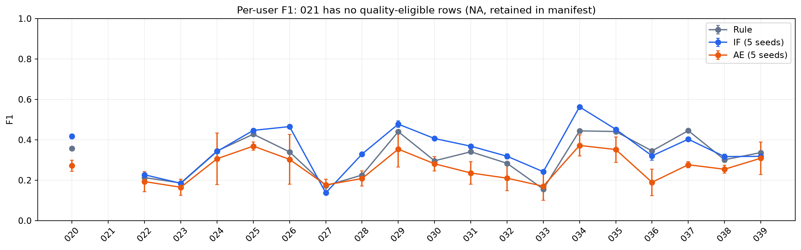
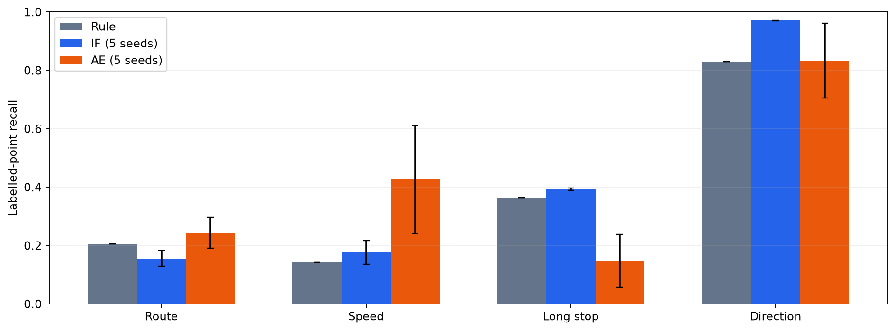
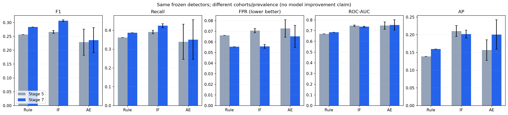
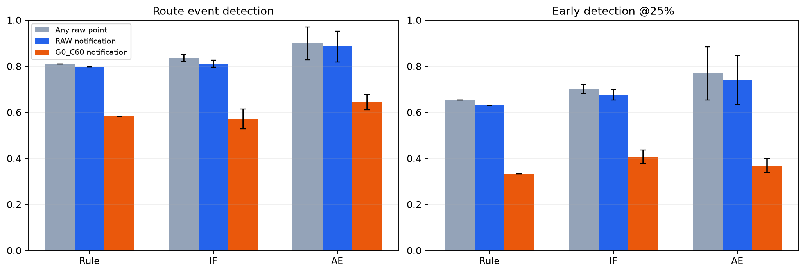
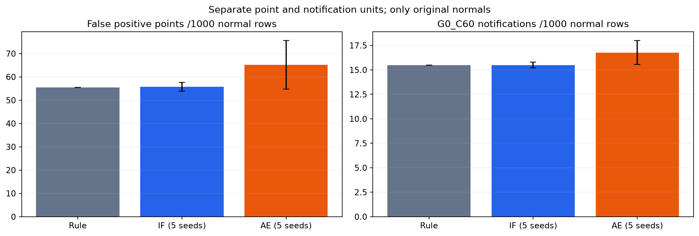
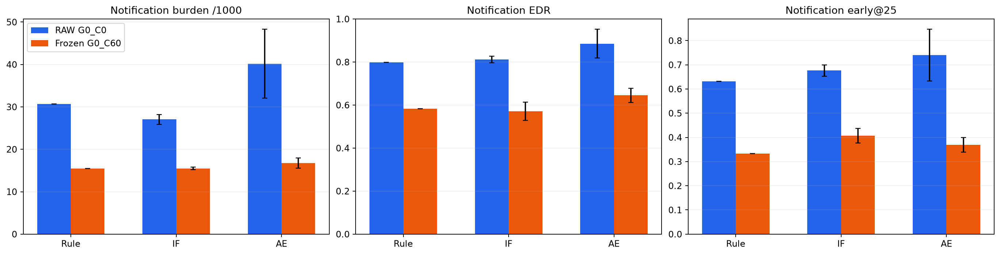

# Stage 7: Confirmatory Final Validation

## 1. 목적과 새로운 cohort가 필요한 이유

Stage 5 Test와 Stage 6 탐색 결과는 여러 차례 관찰됐다. 특히 Stage 6.7 policy family 설계에는 기존 Test 분석 이력이 있어 그 Test를 새로운 confirmatory holdout으로 해석할 수 없다. Stage 7은 users020–039를 사전 확정하고 기존 시스템의 일반화와 한계를 새로운 사용자에서 평가했다.

## 2. Protocol freeze와 순서 증거

Freeze commit: **3b267f7c9d6593facc4135c4992d5f2c1144d519**, message stage7: freeze final validation protocol.
[Protocol](../configs/stage7_final_protocol.json) SHA256: **7e8ee719f8b0529fc753366867fa71966fe9aa97cda56f2db7e8798da446a3c4**.
Result manifest SHA256: **6b3b22b5a7b65bc286663577d6c2ac0264eb32c0bfdd2caf9332a5459c20cfa7**.

UTC 순서: protocol seal 2026-10-05T18:26:35.989076 → cohort creation 18:29:10.228290 → inference start 18:30:30.868338 → first successful result freeze 18:34:54.784125. 원본 Final cohort 처리 전에 freeze commit을 원격에 게시했다. [Protocol receipt](artifacts/stage7/final_protocol_manifest.json)와 [result manifest](artifacts/stage7/final_results_manifest.json)에 source/model/dataset hashes를 보존했다.

## 3. Untouched 검사 범위

기존 code, 123개의 CSV와 12개 fitting config의 user 기록을 검사했다. 기존 사용자는000–019이고 Final overlap은0이다. 이 증거는 저장소와 보존된 artifact에 한정하며, 기록되지 않은 외부·수작업 열람의 부재까지 증명하지 않는다.

## 4. Cohort 정의와 deterministic selection

Requested/available20명, missing0명. User020–039, filename lexical first5 최대5개로100개를 고정했다. Stage5 quality policy(min100 points, low-quality ratio≤0.05) 그대로84개가 eligible이고16개 제외됐다. User021은 first5 모두 ineligible이므로 metric NA이며 후보 목록에서 삭제·대체하지 않았다. Actual support19명. [Integrity manifest](artifacts/stage7/final_cohort_integrity.json)의 선택 filename과 per-user count가 authoritative하다.

## 5. Overlap, duplicate, lineage

Stage5 fingerprint(lat/lon 7-decimal + relative elapsed nanoseconds)로 Final 내부와 기존 Train/Validation/Test 입력 trajectory를 비교했다. Internal/cross-stage duplicate exclusions0개/0행, remaining exact duplicates0, prior-user overlap0, lineage errors0, NaN/inf feature count0이다. 중복 발견 시 기록·제외하고 replacement를 하지 않는 코드와 tests를 동결했다. Synthetic 생성은 duplicate 제외 이후에만 수행한다.

## 6. Frozen preprocessing와 generator

8 features는 README와 protocol에 기록된 Stage5 정의다. Generator source hashes와 구성, synthetic base seed42 및 trajectory/type별 기존 seed derivation을 동결했다. Route deviation, abnormal speed, long stop, direction change 각 eligible source에서 한 sample씩 생성해336개다. Amplitude/segment/label/feature recomputation을 바꾸지 않았다.

## 7. 평가 행의 의미

Original normal full223,843행 중 quality-valid223,289행을 한 번 사용한다. Synthetic full895,372행에는 copied normal 구간도 있지만 point 평가에서는 실제 label=1이면서 source-quality-valid인9,263행만 사용한다. Full anomaly-labelled9,283행과 evaluation9,263행은 다른 분모다. 총232,552 evaluation rows. Copied normal을 반복 집계하지 않았다. Route event protocol은 기존 full-label onset과 quality holes를 보존한다.

## 8. Frozen detector

Rule1개, IF5개, AE5개 기존 artifact를 모두 load했다. Reconstruction/retraining0회, scaler fitting0회, threshold recalculation0회, policy reselection0회다. Train normal86,067행과 training users12명은 기존 Stage5와 같다. 전체 artifact path/config/features/users/hash는 [model manifest](artifacts/stage7/final_model_manifest.json)에 있다.

## 9. Frozen threshold와 model/scaler hashes

| Detector | Seed | Threshold | Model SHA256 | Scaler SHA256 |
| --- | --- | --- | --- | --- |
| statistical_rule | None | 13.022437059583535 | b712b392ce5c8cc3fd7e68f58d1c3098e461f3c3eea6924792458cca6369a1e7 | None |
| isolation_forest | 7 | 0.5293137877261866 | 304443cb8548c6caa171d26216ad05a01acb56347a8e30fbf0d6ebd0999c93f0 | 050b2eb529e346816c239804ad2fb38b1750987b98c045c745e035091f780572 |
| isolation_forest | 21 | 0.5226001235731801 | 41a6e1d8728c2f5476124297f68e3aa1e2cbe72081c9f3879a0de8ec04d951c6 | 050b2eb529e346816c239804ad2fb38b1750987b98c045c745e035091f780572 |
| isolation_forest | 42 | 0.5185322801154019 | 0e923a5d22cb5e2658b80f7c71e903bafbe1b1f6793254150bd4e87916058a9d | 050b2eb529e346816c239804ad2fb38b1750987b98c045c745e035091f780572 |
| isolation_forest | 100 | 0.5256011374090075 | 1bb155dada19af49f6d7a9fa39c424e365b3c311012ebe89d14d7ef7f1d042a4 | 050b2eb529e346816c239804ad2fb38b1750987b98c045c745e035091f780572 |
| isolation_forest | 2026 | 0.5226903290175668 | 5fffb525f7dd6ae22c50b0916399843e30589d775fbf5d70e3158a3b3367c70b | 050b2eb529e346816c239804ad2fb38b1750987b98c045c745e035091f780572 |
| autoencoder | 7 | 0.03644596412777901 | f627b51c8cc091af806978fa1d101c1b7e70b7b0bb2867de5ef99877f21df33b | 050b2eb529e346816c239804ad2fb38b1750987b98c045c745e035091f780572 |
| autoencoder | 21 | 0.030056439340114594 | 4dc94f07dc745ea1d1b4772c8aa345dbc5a80c7a2468a1204b7bc3eff7bf87f4 | 050b2eb529e346816c239804ad2fb38b1750987b98c045c745e035091f780572 |
| autoencoder | 42 | 0.14424675703048706 | 4c998941932c0d8f8aa33f59c2fa929cc8e15a0cfda5a473aded1df653e1e960 | 050b2eb529e346816c239804ad2fb38b1750987b98c045c745e035091f780572 |
| autoencoder | 100 | 0.18177686631679535 | 1360bbde22e9982cce9327d5ed07af762ba530b44e051e79a0edcd0b219b1f18 | 050b2eb529e346816c239804ad2fb38b1750987b98c045c745e035091f780572 |
| autoencoder | 2026 | 0.1723373532295227 | 67cd6ddf5668bb8d65af943eb53c421532faadb0dc0ab5d82403ac4a04b553da | 050b2eb529e346816c239804ad2fb38b1750987b98c045c745e035091f780572 |

Model별 validation에서 고정한 threshold를 그대로 사용했다. Seed별 threshold 차이는 기존 artifact의 차이이며 Final 데이터에서 조정한 결과가 아니다.

## 10. Frozen alert policy

모든 family의 **G0_C60**(RAW gate +60sec cooldown)와 Stage6.7 lock SHA256 **082919ec25ae9d4c6f1cb0170142511b64aaf3d3ef14487be32c7b6bce83cebb**를 유지했다. G0_C0는 이미 선언된 RAW notification comparator이며 새로운 candidate search를 수행하지 않았다.

## 11. Pooled point results

IF/AE는 사전 고정된 5개 seed(7, 21, 42, 100, 2026)의 평균 ± 표본 표준편차(ddof=1)다. Rule은 결정론적 단일 결과이므로 seed 표준편차를 NA로 둔다. 단위가 표시되지 않은 비율은 0–1이다.

| Detector | Accuracy | Precision | Recall | F1 | FPR | ROC-AUC | AP |
| --- | --- | --- | --- | --- | --- | --- | --- |
| Rule | 0.9223 | 0.2244 | 0.3870 | 0.2841 | 0.0555 | 0.6857 | 0.1599 |
| Isolation Forest | 0.9235 ± 0.0015 | 0.2401 ± 0.0033 | 0.4247 ± 0.0103 | 0.3067 ± 0.0032 | 0.0558 ± 0.0019 | 0.7370 ± 0.0053 | 0.2021 ± 0.0113 |
| Autoencoder | 0.9116 ± 0.0065 | 0.1798 ± 0.0257 | 0.3508 ± 0.1050 | 0.2364 ± 0.0453 | 0.0652 ± 0.0104 | 0.7529 ± 0.0486 | 0.2007 ± 0.0416 |

## 12. User-macro results

각 seed에서 user별6개 metric을 계산하고 defined users19명의 평균·사용자 표본 SD를 계산했다. 아래 ±는 해당 macro 평균의 **seed 간** SD다. **사용자 간** SD는 [final_user_macro_metrics.csv](artifacts/stage7/final_user_macro_metrics.csv)의 user_sample_std에 별도로 보존했다. 후보20명과 defined19명을 혼동하지 않는다.

| Detector | Precision | Recall | F1 | FPR | ROC-AUC | AP |
| --- | --- | --- | --- | --- | --- | --- |
| Rule | 0.3217 | 0.3843 | 0.3210 | 0.0595 | 0.6956 | 0.2224 |
| Isolation Forest | 0.3520 ± 0.0051 | 0.4255 ± 0.0078 | 0.3546 ± 0.0029 | 0.0572 ± 0.0011 | 0.7697 ± 0.0037 | 0.2912 ± 0.0073 |
| Autoencoder | 0.2445 ± 0.0224 | 0.3472 ± 0.1053 | 0.2631 ± 0.0477 | 0.0707 ± 0.0146 | 0.7679 ± 0.0336 | 0.2672 ± 0.0431 |

## 13. Per-user results

Count는 seed에 불변이므로 SD0이 표시된다. User021 NA 사유는 no evaluation rows다. 모든 후보 사용자를 유지했다. 아래 전체 결과와 [원본 summary CSV](artifacts/stage7/final_user_metrics.csv)는 mean/std/min/max를 제공한다.

| User | Detector | Normal | Anomaly | Precision | Recall | F1 | FPR | ROC-AUC | AP |
| --- | --- | --- | --- | --- | --- | --- | --- | --- | --- |
| 020 | Rule | 5721.0000 | 503.0000 | 0.2924 | 0.4592 | 0.3573 | 0.0977 | 0.7177 | 0.2011 |
| 020 | Isolation Forest | 5721.0000 ± 0.0000 | 503.0000 ± 0.0000 | 0.4236 ± 0.0214 | 0.4103 ± 0.0109 | 0.4166 ± 0.0123 | 0.0493 ± 0.0046 | 0.7229 ± 0.0106 | 0.3689 ± 0.0146 |
| 020 | Autoencoder | 5721.0000 ± 0.0000 | 503.0000 ± 0.0000 | 0.2076 ± 0.0218 | 0.4235 ± 0.1314 | 0.2719 ± 0.0272 | 0.1459 ± 0.0584 | 0.7495 ± 0.0199 | 0.3241 ± 0.0354 |
| 021 | Rule | 0.0000 | 0.0000 | NA | NA | NA | NA | NA | NA |
| 021 | Isolation Forest | 0.0000 ± 0.0000 | 0.0000 ± 0.0000 | NA | NA | NA | NA | NA | NA |
| 021 | Autoencoder | 0.0000 ± 0.0000 | 0.0000 ± 0.0000 | NA | NA | NA | NA | NA | NA |
| 022 | Rule | 21140.0000 | 548.0000 | 0.1413 | 0.4325 | 0.2130 | 0.0681 | 0.7227 | 0.1750 |
| 022 | Isolation Forest | 21140.0000 ± 0.0000 | 548.0000 ± 0.0000 | 0.1525 ± 0.0046 | 0.4453 ± 0.0236 | 0.2271 ± 0.0065 | 0.0642 ± 0.0036 | 0.7792 ± 0.0029 | 0.2066 ± 0.0113 |
| 022 | Autoencoder | 21140.0000 ± 0.0000 | 548.0000 ± 0.0000 | 0.1260 ± 0.0337 | 0.4146 ± 0.0919 | 0.1932 ± 0.0495 | 0.0754 ± 0.0067 | 0.7938 ± 0.0476 | 0.2094 ± 0.0367 |
| 023 | Rule | 21588.0000 | 372.0000 | 0.1230 | 0.3844 | 0.1863 | 0.0472 | 0.7202 | 0.1656 |
| 023 | Isolation Forest | 21588.0000 ± 0.0000 | 372.0000 ± 0.0000 | 0.1150 ± 0.0049 | 0.4683 ± 0.0035 | 0.1846 ± 0.0065 | 0.0622 ± 0.0027 | 0.7610 ± 0.0025 | 0.1013 ± 0.0038 |
| 023 | Autoencoder | 21588.0000 ± 0.0000 | 372.0000 ± 0.0000 | 0.1109 ± 0.0231 | 0.3419 ± 0.1435 | 0.1653 ± 0.0401 | 0.0464 ± 0.0133 | 0.7900 ± 0.0462 | 0.1804 ± 0.0388 |
| 024 | Rule | 4472.0000 | 255.0000 | 0.3333 | 0.3569 | 0.3447 | 0.0407 | 0.7020 | 0.2312 |
| 024 | Isolation Forest | 4472.0000 ± 0.0000 | 255.0000 ± 0.0000 | 0.2957 ± 0.0078 | 0.4071 ± 0.0070 | 0.3425 ± 0.0069 | 0.0553 ± 0.0017 | 0.7480 ± 0.0051 | 0.2224 ± 0.0053 |
| 024 | Autoencoder | 4472.0000 ± 0.0000 | 255.0000 ± 0.0000 | 0.2979 ± 0.1122 | 0.3176 ± 0.1471 | 0.3062 ± 0.1276 | 0.0418 ± 0.0079 | 0.8164 ± 0.0315 | 0.2760 ± 0.0681 |
| 025 | Rule | 1347.0000 | 344.0000 | 0.7143 | 0.3052 | 0.4277 | 0.0312 | 0.5943 | 0.3846 |
| 025 | Isolation Forest | 1347.0000 ± 0.0000 | 344.0000 ± 0.0000 | 0.6086 ± 0.0161 | 0.3529 ± 0.0016 | 0.4467 ± 0.0037 | 0.0581 ± 0.0041 | 0.6957 ± 0.0079 | 0.4524 ± 0.0068 |
| 025 | Autoencoder | 1347.0000 ± 0.0000 | 344.0000 ± 0.0000 | 0.5180 ± 0.0643 | 0.2924 ± 0.0447 | 0.3687 ± 0.0199 | 0.0735 ± 0.0301 | 0.7162 ± 0.0206 | 0.4615 ± 0.0324 |
| 026 | Rule | 3579.0000 | 438.0000 | 0.4316 | 0.2808 | 0.3402 | 0.0453 | 0.7056 | 0.2745 |
| 026 | Isolation Forest | 3579.0000 ± 0.0000 | 438.0000 ± 0.0000 | 0.5694 ± 0.0091 | 0.3936 ± 0.0073 | 0.4654 ± 0.0077 | 0.0364 ± 0.0009 | 0.7916 ± 0.0054 | 0.3733 ± 0.0081 |
| 026 | Autoencoder | 3579.0000 ± 0.0000 | 438.0000 ± 0.0000 | 0.3983 ± 0.1204 | 0.2475 ± 0.1175 | 0.3033 ± 0.1234 | 0.0429 ± 0.0042 | 0.7890 ± 0.0497 | 0.3458 ± 0.0700 |
| 027 | Rule | 15472.0000 | 505.0000 | 0.1033 | 0.5287 | 0.1729 | 0.1498 | 0.6830 | 0.1599 |
| 027 | Isolation Forest | 15472.0000 ± 0.0000 | 505.0000 ± 0.0000 | 0.0789 ± 0.0023 | 0.5335 ± 0.0075 | 0.1375 ± 0.0037 | 0.2033 ± 0.0053 | 0.7170 ± 0.0090 | 0.1485 ± 0.0187 |
| 027 | Autoencoder | 15472.0000 ± 0.0000 | 505.0000 ± 0.0000 | 0.1091 ± 0.0187 | 0.4669 ± 0.0737 | 0.1766 ± 0.0287 | 0.1259 ± 0.0191 | 0.7647 ± 0.0419 | 0.1623 ± 0.0340 |
| 028 | Rule | 26447.0000 | 732.0000 | 0.1726 | 0.3251 | 0.2255 | 0.0431 | 0.6922 | 0.1318 |
| 028 | Isolation Forest | 26447.0000 ± 0.0000 | 732.0000 ± 0.0000 | 0.3039 ± 0.0226 | 0.3637 ± 0.0353 | 0.3293 ± 0.0046 | 0.0234 ± 0.0050 | 0.7383 ± 0.0187 | 0.2612 ± 0.0081 |
| 028 | Autoencoder | 26447.0000 ± 0.0000 | 732.0000 ± 0.0000 | 0.1457 ± 0.0200 | 0.3765 ± 0.1183 | 0.2084 ± 0.0369 | 0.0603 ± 0.0130 | 0.7541 ± 0.0613 | 0.2188 ± 0.0595 |
| 029 | Rule | 6464.0000 | 590.0000 | 0.5089 | 0.3881 | 0.4404 | 0.0342 | 0.7429 | 0.3090 |
| 029 | Isolation Forest | 6464.0000 ± 0.0000 | 590.0000 ± 0.0000 | 0.6009 ± 0.0141 | 0.3963 ± 0.0172 | 0.4775 ± 0.0160 | 0.0240 ± 0.0009 | 0.8496 ± 0.0129 | 0.4678 ± 0.0133 |
| 029 | Autoencoder | 6464.0000 ± 0.0000 | 590.0000 ± 0.0000 | 0.3784 ± 0.0593 | 0.3458 ± 0.1336 | 0.3538 ± 0.0885 | 0.0514 ± 0.0192 | 0.8003 ± 0.0358 | 0.3639 ± 0.0820 |
| 030 | Rule | 4036.0000 | 498.0000 | 0.2558 | 0.3514 | 0.2961 | 0.1261 | 0.6153 | 0.2118 |
| 030 | Isolation Forest | 4036.0000 ± 0.0000 | 498.0000 ± 0.0000 | 0.4284 ± 0.0087 | 0.3867 ± 0.0084 | 0.4064 ± 0.0035 | 0.0637 ± 0.0033 | 0.7755 ± 0.0041 | 0.3586 ± 0.0064 |
| 030 | Autoencoder | 4036.0000 ± 0.0000 | 498.0000 ± 0.0000 | 0.2479 ± 0.0188 | 0.3277 ± 0.0623 | 0.2814 ± 0.0348 | 0.1218 ± 0.0132 | 0.7220 ± 0.0379 | 0.2917 ± 0.0422 |
| 031 | Rule | 19116.0000 | 508.0000 | 0.2939 | 0.4055 | 0.3408 | 0.0259 | 0.7177 | 0.2169 |
| 031 | Isolation Forest | 19116.0000 ± 0.0000 | 508.0000 ± 0.0000 | 0.3442 ± 0.0068 | 0.3965 ± 0.0082 | 0.3685 ± 0.0056 | 0.0201 ± 0.0007 | 0.8010 ± 0.0231 | 0.2743 ± 0.0150 |
| 031 | Autoencoder | 19116.0000 ± 0.0000 | 508.0000 ± 0.0000 | 0.1879 ± 0.0447 | 0.3327 ± 0.1106 | 0.2360 ± 0.0555 | 0.0392 ± 0.0156 | 0.7581 ± 0.0423 | 0.2257 ± 0.0584 |
| 032 | Rule | 7098.0000 | 337.0000 | 0.2276 | 0.3769 | 0.2838 | 0.0607 | 0.6964 | 0.1473 |
| 032 | Isolation Forest | 7098.0000 ± 0.0000 | 337.0000 ± 0.0000 | 0.2518 ± 0.0124 | 0.4344 ± 0.0110 | 0.3187 ± 0.0120 | 0.0614 ± 0.0035 | 0.7956 ± 0.0012 | 0.1900 ± 0.0033 |
| 032 | Autoencoder | 7098.0000 ± 0.0000 | 337.0000 ± 0.0000 | 0.1669 ± 0.0291 | 0.3068 ± 0.1596 | 0.2102 ± 0.0621 | 0.0695 ± 0.0272 | 0.7872 ± 0.0282 | 0.1563 ± 0.0207 |
| 033 | Rule | 13969.0000 | 485.0000 | 0.0981 | 0.3835 | 0.1562 | 0.1224 | 0.6504 | 0.0882 |
| 033 | Isolation Forest | 13969.0000 ± 0.0000 | 485.0000 ± 0.0000 | 0.1647 ± 0.0082 | 0.4565 ± 0.0059 | 0.2420 ± 0.0096 | 0.0805 ± 0.0039 | 0.7572 ± 0.0022 | 0.1452 ± 0.0055 |
| 033 | Autoencoder | 13969.0000 ± 0.0000 | 485.0000 ± 0.0000 | 0.1154 ± 0.0454 | 0.3266 ± 0.1503 | 0.1703 ± 0.0700 | 0.0848 ± 0.0071 | 0.7770 ± 0.0430 | 0.1369 ± 0.0384 |
| 034 | Rule | 3492.0000 | 504.0000 | 0.5012 | 0.3988 | 0.4442 | 0.0573 | 0.6823 | 0.3427 |
| 034 | Isolation Forest | 3492.0000 ± 0.0000 | 504.0000 ± 0.0000 | 0.7513 ± 0.0242 | 0.4504 ± 0.0073 | 0.5630 ± 0.0083 | 0.0216 ± 0.0029 | 0.8553 ± 0.0021 | 0.5917 ± 0.0057 |
| 034 | Autoencoder | 3492.0000 ± 0.0000 | 504.0000 ± 0.0000 | 0.3906 ± 0.0306 | 0.3647 ± 0.0925 | 0.3722 ± 0.0527 | 0.0826 ± 0.0230 | 0.7778 ± 0.0450 | 0.4137 ± 0.0620 |
| 035 | Rule | 6498.0000 | 402.0000 | 0.5615 | 0.3632 | 0.4411 | 0.0175 | 0.7961 | 0.3456 |
| 035 | Isolation Forest | 6498.0000 ± 0.0000 | 402.0000 ± 0.0000 | 0.4452 ± 0.0161 | 0.4592 ± 0.0052 | 0.4519 ± 0.0067 | 0.0355 ± 0.0026 | 0.8444 ± 0.0056 | 0.4166 ± 0.0104 |
| 035 | Autoencoder | 6498.0000 ± 0.0000 | 402.0000 ± 0.0000 | 0.3486 ± 0.1122 | 0.3886 ± 0.0796 | 0.3519 ± 0.0628 | 0.0550 ± 0.0392 | 0.7113 ± 0.0329 | 0.3281 ± 0.0360 |
| 036 | Rule | 38721.0000 | 794.0000 | 0.3024 | 0.4018 | 0.3451 | 0.0190 | 0.7043 | 0.1955 |
| 036 | Isolation Forest | 38721.0000 ± 0.0000 | 794.0000 ± 0.0000 | 0.2563 ± 0.0347 | 0.4370 ± 0.0319 | 0.3207 ± 0.0212 | 0.0268 ± 0.0067 | 0.6188 ± 0.0103 | 0.1942 ± 0.0161 |
| 036 | Autoencoder | 38721.0000 ± 0.0000 | 794.0000 ± 0.0000 | 0.1351 ± 0.0475 | 0.3368 ± 0.1305 | 0.1897 ± 0.0658 | 0.0457 ± 0.0168 | 0.7524 ± 0.1318 | 0.1613 ± 0.0618 |
| 037 | Rule | 8274.0000 | 544.0000 | 0.4955 | 0.4044 | 0.4453 | 0.0271 | 0.6847 | 0.2536 |
| 037 | Isolation Forest | 8274.0000 ± 0.0000 | 544.0000 ± 0.0000 | 0.4002 ± 0.0070 | 0.4059 ± 0.0144 | 0.4029 ± 0.0081 | 0.0400 ± 0.0018 | 0.8470 ± 0.0084 | 0.3371 ± 0.0143 |
| 037 | Autoencoder | 8274.0000 ± 0.0000 | 544.0000 ± 0.0000 | 0.2501 ± 0.0332 | 0.3191 ± 0.0482 | 0.2767 ± 0.0149 | 0.0651 ± 0.0194 | 0.7990 ± 0.0277 | 0.2316 ± 0.0330 |
| 038 | Rule | 9172.0000 | 457.0000 | 0.2742 | 0.3348 | 0.3015 | 0.0442 | 0.6628 | 0.1488 |
| 038 | Isolation Forest | 9172.0000 ± 0.0000 | 457.0000 ± 0.0000 | 0.2566 ± 0.0140 | 0.4153 ± 0.0089 | 0.3171 ± 0.0112 | 0.0601 ± 0.0044 | 0.7618 ± 0.0077 | 0.2231 ± 0.0112 |
| 038 | Autoencoder | 9172.0000 ± 0.0000 | 457.0000 ± 0.0000 | 0.2150 ± 0.0318 | 0.3208 ± 0.0480 | 0.2543 ± 0.0191 | 0.0603 ± 0.0177 | 0.7263 ± 0.0089 | 0.2644 ± 0.0267 |
| 039 | Rule | 6683.0000 | 447.0000 | 0.2806 | 0.4206 | 0.3366 | 0.0721 | 0.7260 | 0.2433 |
| 039 | Isolation Forest | 6683.0000 ± 0.0000 | 447.0000 ± 0.0000 | 0.2398 ± 0.0045 | 0.4725 ± 0.0037 | 0.3181 ± 0.0046 | 0.1002 ± 0.0019 | 0.7641 ± 0.0032 | 0.1987 ± 0.0186 |
| 039 | Autoencoder | 6683.0000 ± 0.0000 | 447.0000 ± 0.0000 | 0.2964 ± 0.0758 | 0.3459 ± 0.1437 | 0.3087 ± 0.0805 | 0.0568 ± 0.0232 | 0.8045 ± 0.0313 | 0.3258 ± 0.0641 |

## 14. Anomaly-type results

ROC-AUC/AP는 해당 type의 labelled anomaly rows와 **전체223,289 normal rows**를 비교한다. 다른 type anomaly를 normal에 섞지 않는다.

| Type | Detector | Anomaly rows | Recall | ROC-AUC vs all normal | AP vs all normal |
| --- | --- | --- | --- | --- | --- |
| route_deviation | Rule | 1762.0000 | 0.2054 | 0.6169 | 0.0194 |
| route_deviation | Isolation Forest | 1762.0000 ± 0.0000 | 0.1556 ± 0.0267 | 0.5745 ± 0.0058 | 0.0133 ± 0.0014 |
| route_deviation | Autoencoder | 1762.0000 ± 0.0000 | 0.2439 ± 0.0527 | 0.6395 ± 0.0461 | 0.0182 ± 0.0032 |
| abnormal_speed | Rule | 1620.0000 | 0.1420 | 0.5883 | 0.1114 |
| abnormal_speed | Isolation Forest | 1620.0000 ± 0.0000 | 0.1763 ± 0.0401 | 0.6735 ± 0.0042 | 0.0138 ± 0.0010 |
| abnormal_speed | Autoencoder | 1620.0000 ± 0.0000 | 0.4262 ± 0.1852 | 0.8251 ± 0.0509 | 0.1343 ± 0.0192 |
| long_stop | Rule | 4040.0000 | 0.3629 | 0.6302 | 0.0472 |
| long_stop | Isolation Forest | 4040.0000 ± 0.0000 | 0.3930 ± 0.0044 | 0.7226 ± 0.0133 | 0.0633 ± 0.0027 |
| long_stop | Autoencoder | 4040.0000 ± 0.0000 | 0.1469 ± 0.0904 | 0.6777 ± 0.0711 | 0.0447 ± 0.0132 |
| direction_change | Rule | 1841.0000 | 0.8294 | 0.9589 | 0.1565 |
| direction_change | Isolation Forest | 1841.0000 ± 0.0000 | 0.9703 ± 0.0015 | 0.9797 ± 0.0021 | 0.3679 ± 0.0414 |
| direction_change | Autoencoder | 1841.0000 ± 0.0000 | 0.8339 ± 0.1280 | 0.9628 ± 0.0177 | 0.2679 ± 0.0612 |

## 15. Stage 5 versus Stage 7

Stage5 Test normal46,299 / anomaly2,112와 Stage7 normal223,289 / anomaly9,263의 크기와 유병률·사용자 구성은 다르다. Delta는 동일 frozen detector의 cohort 간 차이다. 새 학습이나 model quality 개선의 증거로 해석하지 않는다.

| Detector | Metric | Stage 5 mean ± SD | Stage 7 mean ± SD | Delta |
| --- | --- | --- | --- | --- |
| Autoencoder | recall | 0.3390 ± 0.0938 | 0.3508 ± 0.1050 | +0.011735 |
| Autoencoder | f1_score | 0.2291 ± 0.0474 | 0.2364 ± 0.0453 | +0.007342 |
| Autoencoder | false_positive_rate | 0.0726 ± 0.0082 | 0.0652 ± 0.0104 | -0.007440 |
| Autoencoder | roc_auc | 0.7476 ± 0.0341 | 0.7529 ± 0.0486 | +0.005235 |
| Autoencoder | average_precision | 0.1568 ± 0.0290 | 0.2007 ± 0.0416 | +0.043873 |
| Isolation Forest | recall | 0.3910 ± 0.0092 | 0.4247 ± 0.0103 | +0.033675 |
| Isolation Forest | f1_score | 0.2660 ± 0.0054 | 0.3067 ± 0.0032 | +0.040689 |
| Isolation Forest | false_positive_rate | 0.0706 ± 0.0020 | 0.0558 ± 0.0019 | -0.014873 |
| Isolation Forest | roc_auc | 0.7467 ± 0.0062 | 0.7370 ± 0.0053 | -0.009778 |
| Isolation Forest | average_precision | 0.2106 ± 0.0155 | 0.2021 ± 0.0113 | -0.008514 |
| Rule | recall | 0.3613 | 0.3870 | +0.025755 |
| Rule | f1_score | 0.2569 | 0.2841 | +0.027150 |
| Rule | false_positive_rate | 0.0662 | 0.0555 | -0.010690 |
| Rule | roc_auc | 0.6693 | 0.6857 | +0.016309 |
| Rule | average_precision | 0.1388 | 0.1599 | +0.021125 |

## 16. Raw point route-event results

84개의 route events에 Stage6.6 grouping/onset/quality protocol을 재사용했다. EDR은 any positive point이고 Early@10/25/50의 분모는 전체 events다. Delay는 detected events 조건부이며 missed event의 delay는 NA다. Seed aggregate median/p90은 **seed별 median/p90의 평균**으로, 모든 seed event를 pool한 percentile이 아니다.

| Detector | Metric | Mean ± seed SD |
| --- | --- | --- |
| Rule | event_detection_rate | 0.8095 |
| Rule | early_detection_10_rate | 0.5833 |
| Rule | early_detection_25_rate | 0.6548 |
| Rule | early_detection_50_rate | 0.6786 |
| Rule | delay_points_median | 1.0000 |
| Rule | delay_points_p90 | 11.0000 |
| Rule | delay_seconds_median | 2.0000 |
| Rule | delay_seconds_p90 | 68.6000 |
| Rule | event_point_coverage_median | 0.1091 |
| Rule | median_longest_positive_run_points | 1.0000 |
| Rule | mean_positive_run_count | 2.0000 |
| Isolation Forest | event_detection_rate | 0.8357 ± 0.0155 |
| Isolation Forest | early_detection_10_rate | 0.6548 ± 0.0146 |
| Isolation Forest | early_detection_25_rate | 0.7024 ± 0.0188 |
| Isolation Forest | early_detection_50_rate | 0.7190 ± 0.0199 |
| Isolation Forest | delay_points_median | 1.0000 ± 0.0000 |
| Isolation Forest | delay_points_p90 | 11.2200 ± 0.4382 |
| Isolation Forest | delay_seconds_median | 2.0000 ± 0.0000 |
| Isolation Forest | delay_seconds_p90 | 52.7600 ± 3.1389 |
| Isolation Forest | event_point_coverage_median | 0.0736 ± 0.0093 |
| Isolation Forest | median_longest_positive_run_points | 1.0000 ± 0.0000 |
| Isolation Forest | mean_positive_run_count | 1.5071 ± 0.0885 |
| Autoencoder | event_detection_rate | 0.9000 ± 0.0707 |
| Autoencoder | early_detection_10_rate | 0.7000 ± 0.1384 |
| Autoencoder | early_detection_25_rate | 0.7690 ± 0.1150 |
| Autoencoder | early_detection_50_rate | 0.8262 ± 0.1060 |
| Autoencoder | delay_points_median | 1.0000 ± 0.0000 |
| Autoencoder | delay_points_p90 | 8.1800 ± 4.3945 |
| Autoencoder | delay_seconds_median | 2.4000 ± 0.5477 |
| Autoencoder | delay_seconds_p90 | 45.5600 ± 27.5061 |
| Autoencoder | event_point_coverage_median | 0.1782 ± 0.0784 |
| Autoencoder | median_longest_positive_run_points | 1.6000 ± 0.5477 |
| Autoencoder | mean_positive_run_count | 2.2595 ± 0.3396 |

## 17. Original-normal false alerts

원본 normal trajectory84개를 한 번씩 사용했다. FP point와 positive run과 notification은 별도 단위다. 시간당 burden은 관측 가능한 기존 quality-valid exposure 정의이며 이동 전체 wall-clock 위험률을 의미하지 않는다. 전체 raw run/exposure/notification 통계는 [alert summary](artifacts/stage7/final_alert_summary.csv)에 있다.

## 18. RAW notification versus locked notification

Onset에 gate/cooldown을 reset하지 않는다. 기존 prefix의 positive run 또는 false notification이 event notification을 막을 수 있어 RAW **notification** EDR은 raw **point** EDR보다 낮을 수 있다.

| Detector | Metric | RAW G0_C0 | LOCKED G0_C60 |
| --- | --- | --- | --- |
| Rule | notification_event_detection_rate | 0.7976 | 0.5833 |
| Rule | notification_early25_rate | 0.6310 | 0.3333 |
| Rule | notification_delay_points_median | 1.0000 | 1.0000 |
| Rule | notification_delay_points_p90 | 11.0000 | 16.0000 |
| Rule | notification_delay_seconds_median | 2.0000 | 5.0000 |
| Rule | notification_delay_seconds_p90 | 68.8000 | 81.8000 |
| Rule | raw_fp_points | 12390.0000 | 12390.0000 |
| Rule | raw_fp_per_1000 | 55.4886 | 55.4886 |
| Rule | raw_any_alert_percent | 100.0000 | 100.0000 |
| Rule | false_gate_run_count | 6862.0000 | 6862.0000 |
| Rule | false_notification_count | 6862.0000 | 3456.0000 |
| Rule | false_notifications_per_1000_normal_points | 30.7315 | 15.4777 |
| Rule | any_notification_trajectory_percent | 100.0000 | 100.0000 |
| Rule | cooldown_induced_missed_events | 0.0000 | 18.0000 |
| Rule | cooldown_delayed_events | 0.0000 | 9.0000 |
| Isolation Forest | notification_event_detection_rate | 0.8119 ± 0.0155 | 0.5714 ± 0.0429 |
| Isolation Forest | notification_early25_rate | 0.6762 ± 0.0229 | 0.4071 ± 0.0296 |
| Isolation Forest | notification_delay_points_median | 1.0000 ± 0.0000 | 1.0000 ± 0.0000 |
| Isolation Forest | notification_delay_points_p90 | 11.4200 ± 0.5586 | 15.5200 ± 1.8363 |
| Isolation Forest | notification_delay_seconds_median | 2.0000 ± 0.0000 | 3.8000 ± 0.8367 |
| Isolation Forest | notification_delay_seconds_p90 | 54.1200 ± 3.8389 | 80.2800 ± 7.9430 |
| Isolation Forest | raw_fp_points | 12452.4000 ± 421.1144 | 12452.4000 ± 421.1144 |
| Isolation Forest | raw_fp_per_1000 | 55.7681 ± 1.8860 | 55.7681 ± 1.8860 |
| Isolation Forest | raw_any_alert_percent | 100.0000 ± 0.0000 | 100.0000 ± 0.0000 |
| Isolation Forest | false_gate_run_count | 6040.4000 ± 256.8361 | 6040.4000 ± 256.8361 |
| Isolation Forest | false_notification_count | 6040.4000 ± 256.8361 | 3460.4000 ± 67.0172 |
| Isolation Forest | false_notifications_per_1000_normal_points | 27.0519 ± 1.1502 | 15.4974 ± 0.3001 |
| Isolation Forest | any_notification_trajectory_percent | 100.0000 ± 0.0000 | 100.0000 ± 0.0000 |
| Isolation Forest | cooldown_induced_missed_events | 0.0000 ± 0.0000 | 20.2000 ± 2.6833 |
| Isolation Forest | cooldown_delayed_events | 0.0000 ± 0.0000 | 4.0000 ± 1.2247 |
| Autoencoder | notification_event_detection_rate | 0.8857 ± 0.0671 | 0.6452 ± 0.0330 |
| Autoencoder | notification_early25_rate | 0.7405 ± 0.1069 | 0.3690 ± 0.0304 |
| Autoencoder | notification_delay_points_median | 1.0000 ± 0.0000 | 2.1000 ± 1.7464 |
| Autoencoder | notification_delay_points_p90 | 8.7600 ± 4.6377 | 16.7200 ± 1.7810 |
| Autoencoder | notification_delay_seconds_median | 2.6000 ± 0.5477 | 6.9000 ± 3.4713 |
| Autoencoder | notification_delay_seconds_p90 | 48.5800 ± 29.8552 | 85.3800 ± 14.1627 |
| Autoencoder | raw_fp_points | 14550.0000 ± 2319.9490 | 14550.0000 ± 2319.9490 |
| Autoencoder | raw_fp_per_1000 | 65.1622 ± 10.3899 | 65.1622 ± 10.3899 |
| Autoencoder | raw_any_alert_percent | 99.7619 ± 0.5324 | 99.7619 ± 0.5324 |
| Autoencoder | false_gate_run_count | 8971.8000 ± 1818.5498 | 8971.8000 ± 1818.5498 |
| Autoencoder | false_notification_count | 8971.8000 ± 1818.5498 | 3745.2000 ± 271.1415 |
| Autoencoder | false_notifications_per_1000_normal_points | 40.1802 ± 8.1444 | 16.7729 ± 1.2143 |
| Autoencoder | any_notification_trajectory_percent | 99.7619 ± 0.5324 | 99.7619 ± 0.5324 |
| Autoencoder | cooldown_induced_missed_events | 0.0000 ± 0.0000 | 20.2000 ± 4.8166 |
| Autoencoder | cooldown_delayed_events | 0.0000 ± 0.0000 | 13.0000 ± 6.0415 |

Notification 감소율은 family mean counts의 비율로 Rule49.635675%, IF42.712403%, AE58.255868%다. Seed별 reduction ratio 평균/SD와 구분하며 [reduction CSV](artifacts/stage7/final_notification_reduction.csv)에 둘 다 기록했다. Locked EDR/Early@25가 하락하고 cooldown 추가 missed events 평균은18/20.2/20.2개다.

## 19. Seed stability

| Detector | Metric | Mean | Seed SD | Min | Max |
| --- | --- | --- | --- | --- | --- |
| Autoencoder | recall | 0.3508 | 0.1050 | 0.2420 | 0.4645 |
| Autoencoder | f1_score | 0.2364 | 0.0453 | 0.1858 | 0.2943 |
| Autoencoder | roc_auc | 0.7529 | 0.0486 | 0.7063 | 0.8178 |
| Autoencoder | average_precision | 0.2007 | 0.0416 | 0.1584 | 0.2476 |
| Isolation Forest | recall | 0.4247 | 0.0103 | 0.4130 | 0.4410 |
| Isolation Forest | f1_score | 0.3067 | 0.0032 | 0.3032 | 0.3102 |
| Isolation Forest | roc_auc | 0.7370 | 0.0053 | 0.7290 | 0.7429 |
| Isolation Forest | average_precision | 0.2021 | 0.0113 | 0.1911 | 0.2149 |
| Rule | recall | 0.3870 | NA | 0.3870 | 0.3870 |
| Rule | f1_score | 0.2841 | NA | 0.2841 | 0.2841 |
| Rule | roc_auc | 0.6857 | NA | 0.6857 | 0.6857 |
| Rule | average_precision | 0.1599 | NA | 0.1599 | 0.1599 |

AE recall seed SD0.1050, F1 SD0.0453으로 IF(F1 SD0.0032)보다 불안정하다. Canonical seed42를 best seed로 선택하지 않았고 모든 seed를 보고한다. Single Rule의 sample SD는 수학적으로 정의되지 않아 NA다.

## 20. User variability

IF user mean F1은0.1375(user027)–0.5630(user034), Rule0.1562(user033)–0.4453(user037), AE0.1653(user023)–0.3722(user034)다. 낮은 사용자 성능을 그대로 유지했다. Pooled/macro 차이는 사용자 행 수 가중치에 영향을 받는다. 이 범위는 user별 seed-mean 값이며 seed range와 다르다.

## 21. Independent verification / integrity

전체543 tests PASS, 신규85, 기존458 regression 유지. 보호578파일 changed0. [독립 verifier](../src/verify_final_validation.py)는 저장된2,558,072 prediction rows,220 per-user checks,1,848 event-policy 및1,848 normal-policy scalar replay를 검증했다. 새 model inference 없이 point confusion/ROC/AP, seed ddof1, macro/type/event/false-alert/hash를 재확인했다. [검증 receipt](artifacts/stage7/independent_verification.json).

Undefined single-seed SD/zero-row metric/missed delay는 이유를 기록한 NA다. 이를 Inf나 조용한0으로 바꾸지 않았다. [NA report](artifacts/stage7/final_metric_na_report.csv).

## 22. Reproduced findings / largest degradation

IF는 pooled F1 최고0.3067과 안정적인 seed 결과를 보인다. AE는 ROC-AUC0.7529와 raw route-event EDR0.9000이 높지만 낮은 precision과 큰 변동성을 동반한다. 강하게 재현된 한계는 낮은 route point recall과 거의 모든 normal trajectory의 notification이다. Stage5 대비 IF ROC-AUC−0.009778/AP−0.008514가 하락했다. Locked Early@25는 RAW notification 대비 Rule약29.76pp, IF26.90pp, AE37.14pp 하락했다. 서로 다른 비교 단위를 구분한다.

## 23. Limitations

Synthetic anomaly는 실제 범죄·실종·위험 행동 label이 아니다. 원본을 normal로 간주하는 실험 가정도 실제 정상성의 보증이 아니다. GeoLife의 시간적·지역적 범위, 사용자별 이동 다양성, 20명 후보 중 19명만 평가 가능한 작은 cohort, route context generalization 한계가 있다. 높은 event detection은 event precision이나 production precision을 의미하지 않는다. 정상 trajectory의 거의 전부에 notification이 발생해 false-alert burden이 크다. Alert policy는 Stage 6에서 설계·동결한 정책이며 실제 online deployment, 지연·메모리·센서 오류 대응은 검증하지 않았다.

## 24. Final conclusion / project scope

새 unseen cohort에서 일부 point discrimination과 event detection이 재현됐지만, 사용자 차이·seed 변동·route representation·false-alert burden의 한계가 확인됐다. 높은 EDR만으로 실제 서비스의 정확도나 안전성을 주장하지 않는다. 사전 동결한 첫 결과를 삭제·교체·재튜닝하지 않았으며 metric-producing sources/config를 결과 freeze 뒤 수정하지 않았다. 모든 새 아이디어는 Future Work로 남기고 Stage1–7 프로젝트 구현을 종료한다.
